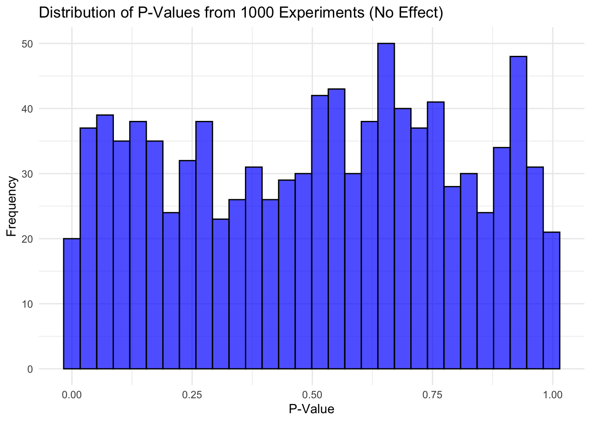
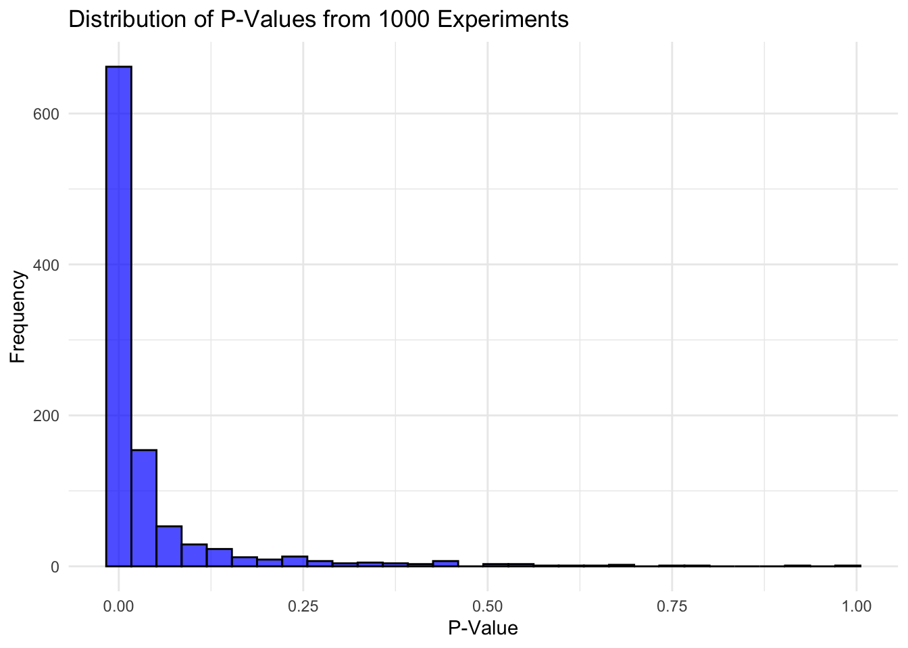
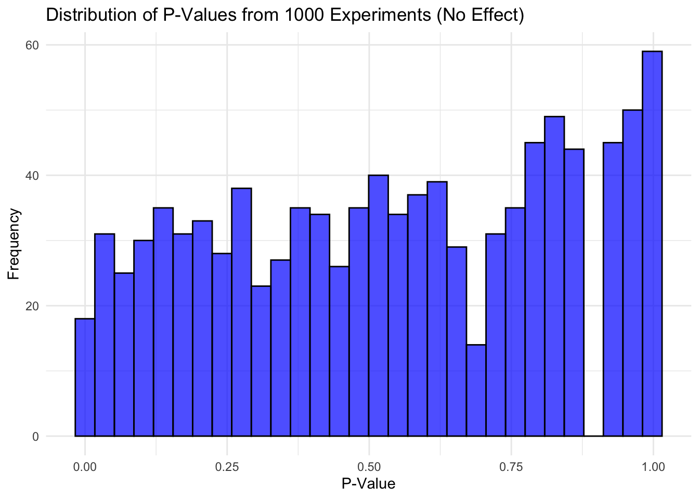
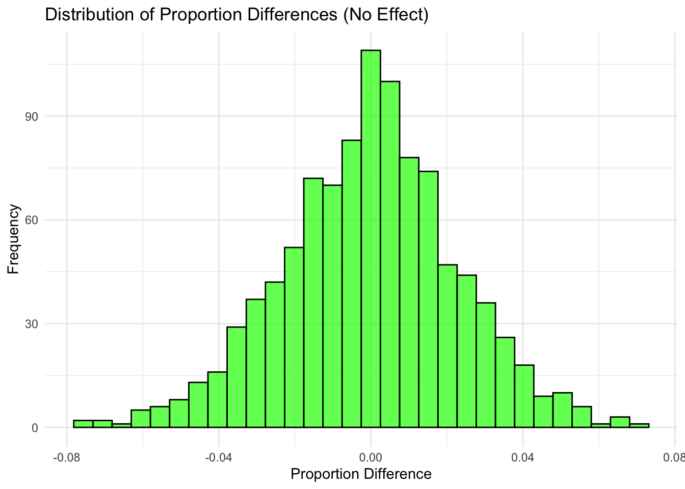
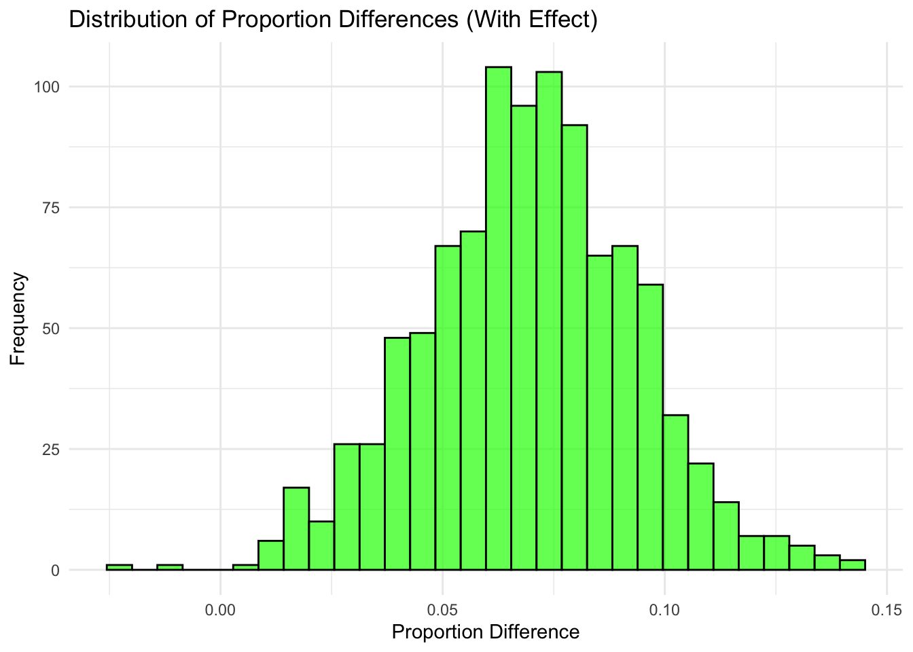
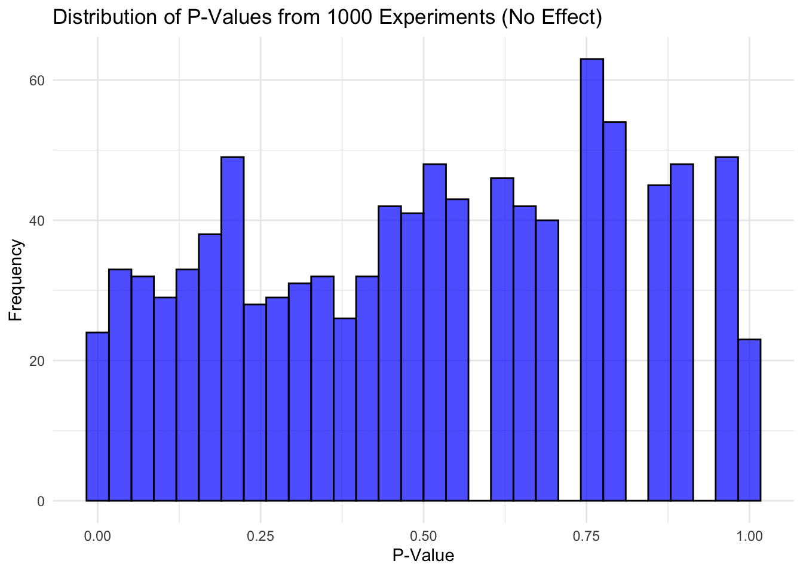
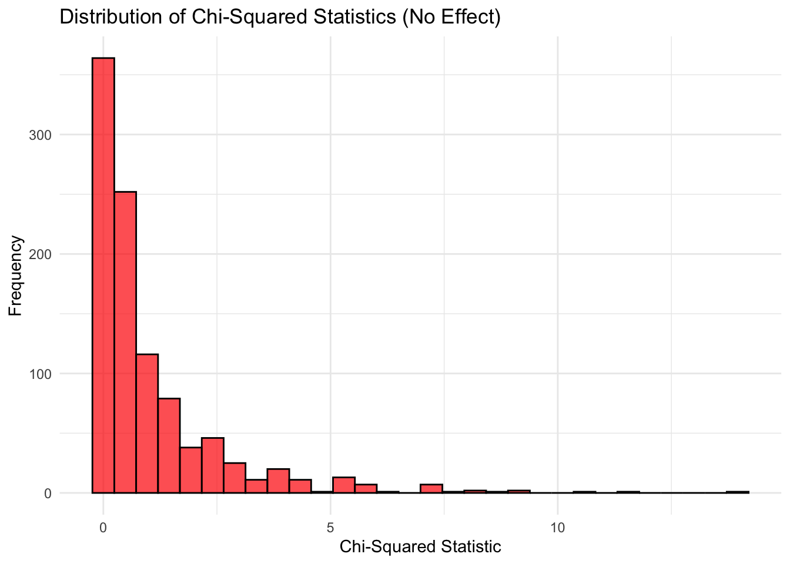
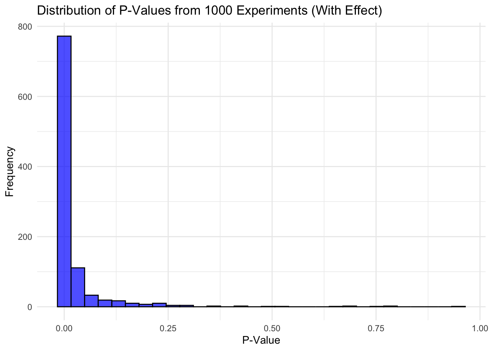
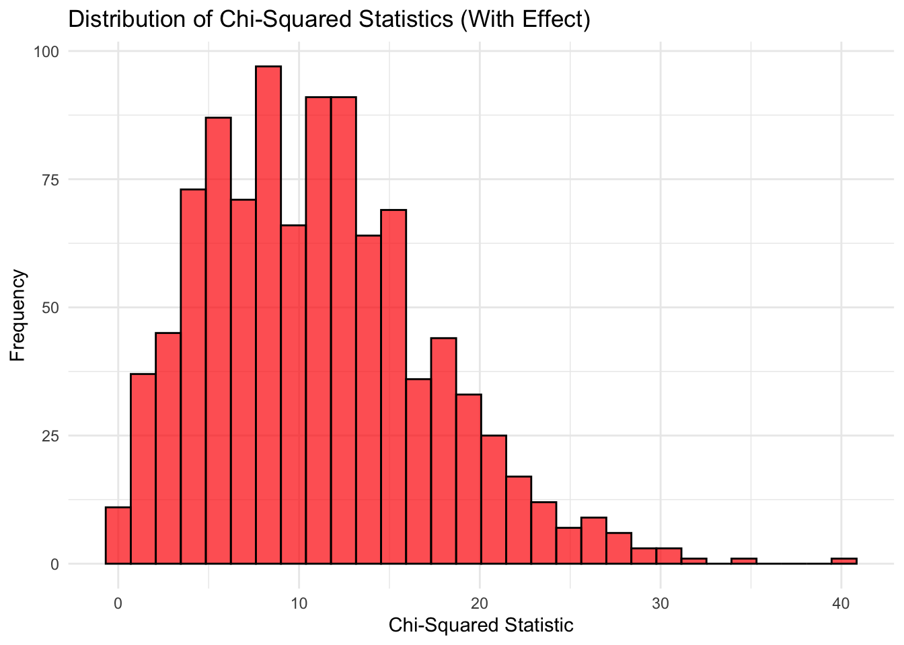

<!DOCTYPE html>
<html xmlns="http://www.w3.org/1999/xhtml" lang="en" xml:lang="en"><head>

<meta charset="utf-8">
<meta name="generator" content="quarto-1.6.39">

<meta name="viewport" content="width=device-width, initial-scale=1.0, user-scalable=yes">

<meta name="author" content="Huan Shuo Hsu, Jinyi Liu">

<title>The Effectiveness of Digital Advertisement in Driving Customer Retention: A Quantitative Analysis of Digital Efficacy</title>

<link href="statistical_research_readme_files/libs/quarto-html/tippy.css" rel="stylesheet">
<link href="statistical_research_readme_files/libs/quarto-html/quarto-syntax-highlighting-e26003cea8cd680ca0c55a263523d882.css" rel="stylesheet" id="quarto-text-highlighting-styles">

<link href="statistical_research_readme_files/libs/bootstrap/bootstrap-icons.css" rel="stylesheet">
<link href="statistical_research_readme_files/libs/bootstrap/bootstrap-973236bd072d72a04ee9cd82dcc9cb29.min.css" rel="stylesheet" append-hash="true" id="quarto-bootstrap" data-mode="light">

</head>

<body>

  <nav id="TOC" role="doc-toc" class="toc-active">
    <h2 id="toc-title">Table of contents</h2>
   
  <ul>
  <li><a href="#research-proposal" id="toc-research-proposal" class="nav-link active" data-scroll-target="#research-proposal"><strong>Research Proposal</strong></a>
  <ul>
  <li><a href="#memo-to-decision-makers" id="toc-memo-to-decision-makers" class="nav-link" data-scroll-target="#memo-to-decision-makers">Memo to Decision Makers</a>
  <ul class="collapse">
  <li><a href="#purpose-objective" id="toc-purpose-objective" class="nav-link" data-scroll-target="#purpose-objective">Purpose / Objective</a></li>
  <li><a href="#background-and-problem" id="toc-background-and-problem" class="nav-link" data-scroll-target="#background-and-problem">Background and Problem</a></li>
  <li><a href="#call-to-action" id="toc-call-to-action" class="nav-link" data-scroll-target="#call-to-action">Call to Action</a></li>
  </ul></li>
  <li><a href="#statement-of-the-problem" id="toc-statement-of-the-problem" class="nav-link" data-scroll-target="#statement-of-the-problem">Statement of the Problem</a></li>
  <li><a href="#literature-review" id="toc-literature-review" class="nav-link" data-scroll-target="#literature-review">Literature Review</a></li>
  <li><a href="#research-questions-hypotheses-and-effects" id="toc-research-questions-hypotheses-and-effects" class="nav-link" data-scroll-target="#research-questions-hypotheses-and-effects">Research Questions, Hypotheses, and Effects</a>
  <ul class="collapse">
  <li><a href="#research-question-1" id="toc-research-question-1" class="nav-link" data-scroll-target="#research-question-1">Research Question 1</a></li>
  <li><a href="#research-question-2" id="toc-research-question-2" class="nav-link" data-scroll-target="#research-question-2">Research Question 2</a></li>
  <li><a href="#research-question-3" id="toc-research-question-3" class="nav-link" data-scroll-target="#research-question-3">Research Question 3</a></li>
  </ul></li>
  <li><a href="#importance-of-the-study-and-social-impact" id="toc-importance-of-the-study-and-social-impact" class="nav-link" data-scroll-target="#importance-of-the-study-and-social-impact">Importance of the Study and Social Impact</a></li>
  <li><a href="#research-plan" id="toc-research-plan" class="nav-link" data-scroll-target="#research-plan">Research Plan</a>
  <ul class="collapse">
  <li><a href="#population-of-interest" id="toc-population-of-interest" class="nav-link" data-scroll-target="#population-of-interest">Population of Interest</a></li>
  <li><a href="#sample-selection" id="toc-sample-selection" class="nav-link" data-scroll-target="#sample-selection">Sample Selection</a></li>
  <li><a href="#operational-procedures" id="toc-operational-procedures" class="nav-link" data-scroll-target="#operational-procedures">Operational Procedures</a></li>
  <li><a href="#brief-schedule" id="toc-brief-schedule" class="nav-link" data-scroll-target="#brief-schedule">Brief Schedule</a></li>
  <li><a href="#data-collection" id="toc-data-collection" class="nav-link" data-scroll-target="#data-collection">Data Collection</a></li>
  <li><a href="#data-security" id="toc-data-security" class="nav-link" data-scroll-target="#data-security">Data Security</a></li>
  <li><a href="#variables" id="toc-variables" class="nav-link" data-scroll-target="#variables">Variables</a></li>
  </ul></li>
  <li><a href="#statistical-analysis-plan" id="toc-statistical-analysis-plan" class="nav-link" data-scroll-target="#statistical-analysis-plan">Statistical Analysis Plan</a>
  <ul class="collapse">
  <li><a href="#t-test" id="toc-t-test" class="nav-link" data-scroll-target="#t-test">T-Test</a></li>
  <li><a href="#proportion-test" id="toc-proportion-test" class="nav-link" data-scroll-target="#proportion-test">Proportion Test</a></li>
  <li><a href="#chi-squared-test-of-independence" id="toc-chi-squared-test-of-independence" class="nav-link" data-scroll-target="#chi-squared-test-of-independence">Chi Squared Test of Independence</a></li>
  </ul></li>
  <li><a href="#sample-size-and-statistical-power" id="toc-sample-size-and-statistical-power" class="nav-link" data-scroll-target="#sample-size-and-statistical-power">Sample Size and Statistical Power</a>
  <ul class="collapse">
  <li><a href="#research-question-1-ad-frequency" id="toc-research-question-1-ad-frequency" class="nav-link" data-scroll-target="#research-question-1-ad-frequency">Research Question 1: Ad Frequency</a></li>
  <li><a href="#research-question-2-ad-type" id="toc-research-question-2-ad-type" class="nav-link" data-scroll-target="#research-question-2-ad-type">Research Question 2: Ad Type</a></li>
  <li><a href="#research-question-3-ad-length" id="toc-research-question-3-ad-length" class="nav-link" data-scroll-target="#research-question-3-ad-length">Research Question 3: Ad Length</a></li>
  </ul></li>
  <li><a href="#possible-recommendations" id="toc-possible-recommendations" class="nav-link" data-scroll-target="#possible-recommendations">Possible Recommendations</a>
  <ul class="collapse">
  <li><a href="#research-question-1-ad-frequency-1" id="toc-research-question-1-ad-frequency-1" class="nav-link" data-scroll-target="#research-question-1-ad-frequency-1">Research Question 1: Ad Frequency</a></li>
  <li><a href="#research-question-2-ad-type-1" id="toc-research-question-2-ad-type-1" class="nav-link" data-scroll-target="#research-question-2-ad-type-1">Research Question 2: Ad Type</a></li>
  <li><a href="#research-question-3-ad-length-1" id="toc-research-question-3-ad-length-1" class="nav-link" data-scroll-target="#research-question-3-ad-length-1">Research Question 3: Ad Length</a></li>
  </ul></li>
  <li><a href="#limitations-and-uncertainties" id="toc-limitations-and-uncertainties" class="nav-link" data-scroll-target="#limitations-and-uncertainties">Limitations and Uncertainties</a></li>
  </ul></li>
  <li><a href="#simulation-of-effects" id="toc-simulation-of-effects" class="nav-link" data-scroll-target="#simulation-of-effects"><strong>Simulation of Effects</strong></a>
  <ul>
  <li><a href="#q1-no-effect-t-test" id="toc-q1-no-effect-t-test" class="nav-link" data-scroll-target="#q1-no-effect-t-test">Q1: No Effect (T-test)</a>
  <ul class="collapse">
  <li><a href="#result-reflection" id="toc-result-reflection" class="nav-link" data-scroll-target="#result-reflection">Result Reflection</a></li>
  </ul></li>
  <li><a href="#q1-effect-t-test" id="toc-q1-effect-t-test" class="nav-link" data-scroll-target="#q1-effect-t-test">Q1 Effect (T-test)</a>
  <ul class="collapse">
  <li><a href="#result-reflection-1" id="toc-result-reflection-1" class="nav-link" data-scroll-target="#result-reflection-1">Result Reflection</a></li>
  </ul></li>
  <li><a href="#q2-no-effect-proportion-test" id="toc-q2-no-effect-proportion-test" class="nav-link" data-scroll-target="#q2-no-effect-proportion-test">Q2 No effect (Proportion Test)</a>
  <ul class="collapse">
  <li><a href="#result-reflection-2" id="toc-result-reflection-2" class="nav-link" data-scroll-target="#result-reflection-2">Result Reflection</a></li>
  </ul></li>
  <li><a href="#q2-effect" id="toc-q2-effect" class="nav-link" data-scroll-target="#q2-effect">Q2 Effect</a>
  <ul class="collapse">
  <li><a href="#result-reflection-3" id="toc-result-reflection-3" class="nav-link" data-scroll-target="#result-reflection-3">Result Reflection</a></li>
  </ul></li>
  <li><a href="#q3-no-effect-chi-squared-test-of-independence" id="toc-q3-no-effect-chi-squared-test-of-independence" class="nav-link" data-scroll-target="#q3-no-effect-chi-squared-test-of-independence">Q3 No effect (Chi Squared Test of Independence)</a>
  <ul class="collapse">
  <li><a href="#result-reflection-4" id="toc-result-reflection-4" class="nav-link" data-scroll-target="#result-reflection-4">Result Reflection</a></li>
  </ul></li>
  <li><a href="#q3-effect-chi-squared-test-of-independence" id="toc-q3-effect-chi-squared-test-of-independence" class="nav-link" data-scroll-target="#q3-effect-chi-squared-test-of-independence">Q3 Effect (Chi Squared Test of Independence)</a>
  <ul class="collapse">
  <li><a href="#result-reflection-5" id="toc-result-reflection-5" class="nav-link" data-scroll-target="#result-reflection-5">Result Reflection</a></li>
  </ul></li>
  <li><a href="#table" id="toc-table" class="nav-link" data-scroll-target="#table">Table</a>
  <ul class="collapse">
  <li><a href="#conclusion" id="toc-conclusion" class="nav-link" data-scroll-target="#conclusion">Conclusion</a></li>
  </ul></li>
  </ul></li>
  <li><a href="#references" id="toc-references" class="nav-link" data-scroll-target="#references"><strong>References</strong></a></li>
  </ul>
</nav>

<main class="content" id="quarto-document-content">

<header id="title-block-header" class="quarto-title-block default">

<h1 class="title">The Effectiveness of Digital Advertisement in Driving Customer Retention: A Quantitative Analysis of Digital Efficacy</h1>

    

    
Author

    

             
Huan Shuo Hsu, Jinyi Liu 

          

  

    
  
    
  

  

</header>

<section id="research-proposal" class="level1">
<h1><strong>Research Proposal</strong></h1>
<section id="memo-to-decision-makers" class="level2">
<h2 class="anchored" data-anchor-id="memo-to-decision-makers">Memo to Decision Makers</h2>
<section id="purpose-objective" class="level4">
<h4 class="anchored" data-anchor-id="purpose-objective">Purpose / Objective</h4>

This document presents a plan to improve Coca-Cola’s advertising strategy for an experimented flavor (New Flavor A) using targeted YouTube campaigns. The main goal is to boost Amazon sales, increase customer subscriptions, and encourage more frequent purchases by understanding how different ad strategies—such as frequency, type, and length—impact consumer behavior.

</section>
<section id="background-and-problem" class="level4">
<h4 class="anchored" data-anchor-id="background-and-problem">Background and Problem</h4>

Coca-Cola has always been at the forefront of innovation, but today’s digital marketplace is more competitive than ever. YouTube ads hold great potential for connecting with consumers, yet it’s not entirely clear how specific factors like how often ads are shown, the type of ads used, or their length influence customer decisions. Without this clarity, there’s a risk of overspending on strategies that don’t deliver results. Research shows that refining these elements could lead to noticeable improvements in sales and loyalty, but to do this effectively, Coca-Cola needs evidence-based insights. The research will use data collected over three months through automated systems that track ad performance, sales, and customer behavior. Using proven statistical methods, the study will identify which strategies work best and provide actionable recommendations.

</section>
<section id="call-to-action" class="level4">
<h4 class="anchored" data-anchor-id="call-to-action">Call to Action</h4>

This is an opportunity for Coca-Cola to uncover the most effective ways to reach and engage its audience. By supporting this study, Coca-Cola can make smarter decisions about where to invest its advertising budget and ensure that every dollar spent generates maximum return. We recommend moving forward by finalizing the collaboration, providing access to performance data, and allocating a small budget for data tracking and analysis. Together, we can unlock new insights to strengthen Coca-Cola’s digital marketing strategy and deliver lasting results in a fast-moving market.

</section>
</section>
<section id="statement-of-the-problem" class="level2">
<h2 class="anchored" data-anchor-id="statement-of-the-problem">Statement of the Problem</h2>

Coca-Cola, a global leader in the beverage industry, is facing increasing competition as consumer preferences shift toward water, seltzer, and other flavored drinks (BrandVM). Coca-Cola’s annual revenue for 2022 was <code>$43.004</code> billion, a <code>11.25%</code> increase from 2021, and in 2023, the company’s revenue was <code>$45.754</code> billion, an <code>6.39%</code> increase from 2022 (DemandSage). These figures demonstrate Coca-Cola’s ability to grow its overall business despite changing consumer preferences. The company continues to innovate and adapt its product portfolio, offering a staggering <code>3,500</code> varieties across more than <code>200</code> countries (BrandVM). To add, this adaptability is especially critical in the increasingly competitive digital marketplace, where organizations must continuously optimize their marketing strategies to effectively engage customers and foster long-term loyalty. For a global brand like Coca-Cola, navigating digital platforms effectively is both an opportunity and a challenge. YouTube, with over two billion monthly logged-in users (Macrotrends), provides a unique avenue for increasing brand awareness, promoting products, and fostering customer loyalty. Recognizing this, Coca-Cola aims to leverage YouTube advertising to boost online sales and engagement for its new products. However, uncertainties persist regarding the effects of ad frequency, format, and length on customer behavior. Without addressing these uncertainties, Coca-Cola may fail to fully capitalize on the potential of YouTube advertising, missing out on opportunities to attract consumers’ attention to its innovative products.

The aim of this project is to answer the research questions that were designed to support the research problem.

<ul>
<li>
How would increasing the frequency of YouTube ads (from 1 ad per week to 3 ads per week) impact the online sales on Amazon of New Flavour A Coca Cola over the period of three months?
</li>
<li>
Does the type of YouTube ads (skippable ads, non-skippable ads) have a significant impact on the proportion of automatic subscriptions of New Flavor A Coca Cola on Amazon within three months?
</li>
<li>
Is there a significant association between the length (10s and 30s) of the Youtube Ads and the weekly online purchase frequency per customer on Amazon within three months?
</li>
</ul>
</section>
<section id="literature-review" class="level2">
<h2 class="anchored" data-anchor-id="literature-review">Literature Review</h2>

Jordan Valinsky (2024) reported that Coca-Cola faces increasing competition as consumers shift towards water, seltzers, and bold-flavored drinks from smaller brands like Olipop and Poppi. To address this, the company has introduced a new flavor to align with changing consumer tastes driven by demographic shifts and the growing popularity of flavored sodas, which have outpaced traditional cola sales. However, Coca-Cola’s modest 1% sales growth in North America in 2022 underscores the challenge of staying competitive in a dynamic beverage market.

Nowadays, consumers of all ages and demographics are spending a significant amount of their time on the Internet. Due to these trends, businesses have expanded their marketing campaigns to reach consumers through digital platforms. According to Nielsen (2012), an effective advertising campaign attracts a large audience. In 2014, <code>88%</code> of businesses invested in social media advertising, which accounted for 5% of their advertising budgets. By 2018, this share was projected to double. Pikas and Sorrentino (2014) explored the efficacy of online advertisements on social media platforms such as Facebook, Twitter and YouTube.

According to Soukup (2014), YouTube has become a crucial platform for business. Scholars and experts highlight its potential for video marketing, effective advertising and brand management. Chadha (2018) noted that nearly <code>80%</code> of marketers recognized YouTube as an essential platform for marketing through online digital videos. As a result, YouTube Marketing Communication has become a key promotional strategy, accounting for a significant <code>25%</code> share of promotional money. Jarboe (2009) and Miles (2013) emphasized strategies such as campaign planning, video creation and leverage YouTube’s social networking aspects for marketing success. Moon, Jung, and Lee (2011) explored the impact of video quality and format on ad effectiveness. Pashkevich, Dorai-Raj, Kellar, and Zigmond (2012) studied in-stream advertising and skippable ads and further emphasized YouTube’s versatility as a marketing tool. Li and Lo (2014) examined the effects of ad length, location and context congruity. According to the study, ad duration has an impact on brand identification with long ads being more remembered. Firat’s (2019) study examined the factors influencing YouTube advertising value and its impact on consumer purchase intentions. The research identified that attributes such as informativeness, entertainment, and trendiness significantly enhance advertising value. Additionally, the study established a positive correlation between YouTube ads and consumers’ purchase intentions.

To evaluate the effectiveness and advantages of YouTube ads, it is essential to understand how advertising works on the platform. Based on Bauer (2013), YouTube introduced ads in 2006, providing businesses an opportunity to connect with a border audience. The launch featured Participatory Ads and Brand Channels, with more development followed in subsequent years. The platform now offers a wide range of standard ad formats for use in its video streaming services (Google Ads Help)

<ul>
<li>
Skippable Ads: These are a common ad format on YouTube. These ads are presented before the selected video will stream and can range from <code>10</code> seconds to <code>6</code> minutes in length, with viewers having the option to skip the ad after <code>5</code> seconds. They may also include a call to action button which is displayed either throughout the ad or after a specified duration. Since viewers can skip this type of ad, the primary goal is to capture and retain their interest. Skippable ads allow advertisers to gather a wide range of data including metrics like completed views, partial views, channel subscriptions and call to action completions.
</li>
<li>
Non-skippable Ads: This form of ads are non-skippable and can be presented before, during or after the selected video. These ads typically last <code>10</code> to <code>30</code> seconds and are only available for videos longer than <code>10</code> minutes. Like skippable ads, non-skippable ads also provide advertisers with valuable performance data.
</li>
<li>
Bumper Ads: These are YouTube’s shortest ad format, lasting up to <code>6</code> seconds and appearing at the beginning of a video. Similar to non-skippable ads, they cannot be skipped.
</li>
<li>
Overlay Ads: Also known as banner ads, are displayed within the selected video, hovering at the bottom of the screen. They can appear and disappear at any point during the video.
</li>
</ul>

Subscription e-commerce is a rapidly growing model that offers consumers convenient, personalized, and cost-effective ways to purchase recurring products or services. Amazon’s Subscribe &amp; Save, one of the most popular replenishment subscription services, exemplifies this trend by automating the purchase of essential goods like consumer packaged items at discounted prices with additional perks for subscribers. This approach not only simplifies shopping but also fosters customer loyalty, with <code>45%</code> of replenishment subscribers maintaining their membership for over a year. However, subscription businesses face challenges like high churn rates, requiring a focus on delivering superior customer experiences to retain users and ensure sustainable growth. (Chen, Fenyo, Yang, and Zhang, 2018)

Amazon’s Subscribe &amp; Save offers a flexible and cost-effective way to purchase products like Coca Cola. Customers can choose a one-time purchase or opt for the subscription function to save <code>5%</code> on each order. This method allows customers to customize their delivery schedule, with intervals ranging from <code>2</code> weeks to <code>6</code> months, ensuring consistent supply while avoiding the hassle of reordering. This mechanism not only provides convenience but also encourages customer loyalty through savings and tailored delivery options.

</section>
<section id="research-questions-hypotheses-and-effects" class="level2">
<h2 class="anchored" data-anchor-id="research-questions-hypotheses-and-effects">Research Questions, Hypotheses, and Effects</h2>

To assess the impact of YouTube advertising on the online performance of New Flavor A Coca-Cola, the experiment will test three key advertising strategies: ad frequency, ad type, and ad length. Targeted YouTube campaigns will be implemented to examine their influence on Amazon sales and subscription metrics over three months. The primary outcomes include changes in Amazon sales revenue, the proportion of automatic subscriptions, and weekly purchase frequency per customer, all measured through specific performance metrics.

<section id="research-question-1" class="level3">
<h3 class="anchored" data-anchor-id="research-question-1">Research Question 1</h3>

How would increasing the frequency of YouTube ads (from <code>1</code> ad per week to <code>3</code> ads per week) impact the online sales on Amazon of New Flavour A Coca Cola (12 Pack) over the period of three months?

<ul>
<li><strong>Null Hypothesis (H₀)</strong>: Increasing ad frequency does not significantly increase the sales within three months.</li>
<li><strong>Alternative Hypothesis (H₁</strong>): Increasing ad frequency does significantly increase the sales within three months.</li>
<li><strong>Effect size</strong>: A <code>10%</code> increase in sales within three months would represent a meaningful improvement.</li>
<li><strong>Outcome and Metric</strong>: Track total online sales on Amazon of New Flavor A Coca Cola, measured in revenue over three months.</li>
</ul>
</section>
<section id="research-question-2" class="level3">
<h3 class="anchored" data-anchor-id="research-question-2">Research Question 2</h3>

Does the type of YouTube ads (skippable ads, non-skippable ads) have a significant impact on the proportion of automatic subscriptions of New Flavor A Coca Cola (12 Pack) on Amazon within three months?

<ul>
<li><strong>Null Hypothesis (H₀)</strong>: The type of YouTube ads does not have a significant impact on the proportion of automatic subscriptions for New Flavor A Coca Cola on Amazon within three months.</li>
<li><strong>Alternative Hypothesis (H₁</strong>):The type of YouTube ads has a significant impact on the proportion of automatic subscriptions for New Flavor A Coca Cola on Amazon within three months.</li>
<li><strong>Effect size</strong>:A <code>5%</code> increase in automatic subscriptions would be a meaningful improvement for Coca-Cola.</li>
<li><strong>Outcome and Metric</strong>: Monitor the proportion of subscriptions on Amazon attributed to skippable and non-skippable YouTube ads over three months.</li>
</ul>
</section>
<section id="research-question-3" class="level3">
<h3 class="anchored" data-anchor-id="research-question-3">Research Question 3</h3>

Is there a significant association between the length (<code>10s</code> and <code>30s</code>) of the Youtube Ads and the weekly online purchase frequency of New Flavor A Coca Cola (12 Pack) per customer on Amazon within three months?

<ul>
<li><strong>Null Hypothesis (H₀)</strong>:There is no significant association between the length of Youtube Ads and the weekly online purchase frequency per customer on Amazon within three months.</li>
<li><strong>Alternative Hypothesis (H₁</strong>): There is a significant association between the length of Youtube ads and the weekly online purchase frequency per customer on Amazon within three months.</li>
<li><strong>Effect size</strong>: A <code>2</code> bottle increase in purchase frequency per customer within three months would represent a meaningful<code>10%</code> improvement.</li>
<li><strong>Outcome and Metric</strong>: Record the average weekly purchase frequency per customer.</li>
</ul>
</section>
</section>
<section id="importance-of-the-study-and-social-impact" class="level2">
<h2 class="anchored" data-anchor-id="importance-of-the-study-and-social-impact">Importance of the Study and Social Impact</h2>

The study is essential for Coca Cola as it explores the dynamic digital marketing environment to effectively promote its new product, New Flavor A Coca Cola. Coca-Cola can maximize its marketing expenditures and deepen consumer brand loyalty by determining the most efficient ad forms, frequencies, and budget allocations. This ensures efficient allocation of advertising budgets while reducing unnecessary spending. Understanding how specific YouTube ads characteristics influence consumer behavior will enable Coca Cola to design campaigns that boost both sales and long-term customer loyalty. As Coca Cola faces competition from sparkling water, seltzers and other beverage categories, innovative marketing techniques are important to retain existing customers and attract new ones in the competitive digital marketplace. Beyond commercial objectives, this study has wider societal ramifications. With companies like Coca-Cola continuing to make significant investments in digital marketing, knowing how to properly engage customers can have an impact on their media consumption habits and behavior. In addition to promoting brand loyalty, effective marketing techniques will result in sustained long term customer satisfaction. Moreover, Coca Cola’s success in innovating healthier or more appealing products could influence broader trends toward mode consumer-conscious offerings in the beverage industry.

</section>
<section id="research-plan" class="level2">
<h2 class="anchored" data-anchor-id="research-plan">Research Plan</h2>
<section id="population-of-interest" class="level4">
<h4 class="anchored" data-anchor-id="population-of-interest">Population of Interest</h4>

The recruitment process for the study will begin with collecting qualified candidates from Amazon analytics tools across various platforms, including email lists, social media, and targeted advertisements. The recruitment process will not rely on a traditional survey but instead use YouTube’s ad targeting tools to ensure participants meet the inclusion criteria naturally. Using online activity data and purchase behavior from Amazon, the study can focus on consumers who organically interacted with the ads. This approach eliminates the need for direct survey distribution, reducing recruitment bias. The population of interest will consist of consumers aged <code>18</code> to <code>65</code> who have shopped online after watching YouTube ads relevant to New Flavor A Coca-Cola during the 3-month study period. For the inclusion group, customers with exposure to YouTube ads during the study, having watched at least one relevant ad, made at least one online purchase on Amazon during the study duration, and agreed to participate in the study. For the exclusion group, customers who shopped more than three times a week, or residing outside the geographic area where the YouTube ads are implemented, use ad-blocking software that may prevent them from viewing YouTube ads, have unreliable internet access, which could prevent consistent exposure to YouTube ads, are affiliated with Coca-Cola or its advertising partners, to prevent biases, or have participated in similar studies or experiments involving Coca-Cola or comparable products in the past year.

</section>
<section id="sample-selection" class="level4">
<h4 class="anchored" data-anchor-id="sample-selection">Sample Selection</h4>

Participants will be randomly assigned into groups. Group assignment will be independent of participants’ demographic characteristics or previous engagement behavior. Grouping will be automated based on ad engagement data collected by YouTube’s analytics platform. Participants will remain unaware of their assigned groups to prevent bias and ensure natural behavior during the study. Participants will be assigned into groups based on the variables of interest:

<ul>
<li><strong>Ad Frequency groups</strong>: <code>700</code> Participants will be divided into two groups. A control group consisting of <code>350</code> individuals exposed to 1 ad per week and an experimental group consisting of <code>530</code> individuals exposed to 3 ads per week. (Accounting for dropouts)</li>
<li><strong>Ad Type groups</strong>: <code>1300</code> Participants will be divided into two groups. A control group consisting of <code>650</code> individuals exposed primarily to skippable ads and an experimental group consisting of <code>650</code> individuals exposed to non-skippable ads. (Accounting for dropouts)</li>
<li><strong>Ad Length groups</strong>: <code>1100</code> Participants will be divided into two groups. A control group consisting of <code>550</code> individuals exposed to 10-second ads and an experimental group consisting of <code>550</code> individuals exposed to 30-second ads. (Accounting for dropouts)</li>
</ul>
</section>
<section id="operational-procedures" class="level4">
<h4 class="anchored" data-anchor-id="operational-procedures">Operational Procedures</h4>

The recruitment process will be conducted through digital platforms such as YouTube and Amazon. Participants will be identified based on their interaction with ads for Coca-Cola’s New Flavor A that only sells on Amazon during the study period, as tracked by YouTube analytics tools. Eligible participants will be invited to participate via online messages including a general overview of the study and an informed consent form. No surveys will be used for recruitment. The study will be conducted online using YouTube’s ad delivery and analytics tools. Once eligibility is confirmed, participants will be randomly assigned to one of two groups, anonymized, and encrypted to avoid selection bias. Participants will be exposed to these ads during their regular online activities. YouTube’s system will ensure that participants are exposed to their designated ad types and engagement data will be automatically collected. Online purchase behavior and subscription data will be tracked through Amazon’s analytics tools. Study personnel will receive training on securely handling data and interpreting data from YouTube and Amazon analytics tools. They will also be trained on ethical considerations, including participant confidentiality and compliance with data protection regulations. Study personnel will inform the participants of instructions during the study period with minimal interaction to avoid influencing behavior, limiting communication to providing initial instructions on how the researcher will track their purchases, periodic reminder of the instruction twice a month, and a follow-up instruction once the research has ended. On top of that, participants will have the freedom to withdraw at any point without penalties, and their data will be excluded from the study if they choose to leave. Those who complete the study will receive financial compensation or gift cards proportional to the time and effort required. Finally, the study will follow a structured timeline, beginning with a pre-study survey (from Sample Selection) to collect baseline demographic and behavioral data, followed by the three-month study period with records tracking participants’ purchase behaviours, and concluding with a final post-study survey to measure purchase outcomes, subscriptions, and ad recall.

</section>
<section id="brief-schedule" class="level4">
<h4 class="anchored" data-anchor-id="brief-schedule">Brief Schedule</h4>
<table class="caption-top table">
<caption>Total Duration: 28 Weeks (Approximately 7 Months)</caption>
<colgroup>
<col style="width: 40%">
<col style="width: 27%">
<col style="width: 31%">
</colgroup>
<thead>
<tr class="header">
<th>Phase</th>
<th style="text-align: left;">Week(s)</th>
<th style="text-align: left;">Activities</th>
</tr>
</thead>
<tbody>
<tr class="odd">
<td>Planning and Preparation</td>
<td style="text-align: left;">1-4</td>
<td style="text-align: left;">Finalize research design, develop recruitment materials, train researchers, set up platforms, and pilot testing.</td>
</tr>
<tr class="even">
<td>Recruitment and Assignment</td>
<td style="text-align: left;">5-7</td>
<td style="text-align: left;">Screen participants, obtain consent, and assign participants to groups.</td>
</tr>
<tr class="odd">
<td>Study Implementation</td>
<td style="text-align: left;">8-20</td>
<td style="text-align: left;">Expose participants to ads, track behaviors, and send bi-monthly reminders.</td>
</tr>
<tr class="even">
<td>Post-Study Data Collection and Analysis</td>
<td style="text-align: left;">21-24</td>
<td style="text-align: left;">Analyze data and evaluate hypotheses.</td>
</tr>
<tr class="odd">
<td>Reporting and Dissemination</td>
<td style="text-align: left;">25-28</td>
<td style="text-align: left;">Prepare reports, present findings to stakeholders, and submit for publication or conference presentations.</td>
</tr>
</tbody>
</table>
</section>
<section id="data-collection" class="level4">
<h4 class="anchored" data-anchor-id="data-collection">Data Collection</h4>

Data will be collected using an automated system integrated with YouTube’s analytics tools and Amazon’s sales tracking system: One week before the trial to gauge baseline purchasing habits and subsequent data will be collected over the three-month experimental period. Participants will be exposed to different advertising conditions (frequency, type and length of ad). Meanwhile, Amazon sales data will be collected to measure key outcomes such as total revenue, subscription rates, and weekly purchase frequency. All data will be securely stored, and participants’ identities will remain anonymous to ensure anonymity.

</section>
<section id="data-security" class="level4">
<h4 class="anchored" data-anchor-id="data-security">Data Security</h4>

To ensure data security, all information collected will be anonymized and stored on a secure, password-protected system accessible only to authorized researchers. Data will be encrypted during storage and analysis, and researchers will be trained in ethical data handling practices. Any systems used for data collection or storage will comply with standard privacy regulations, and participants will be informed of these measures during the consent process.

</section>
<section id="variables" class="level4">
<h4 class="anchored" data-anchor-id="variables">Variables</h4>
<section id="outcomes-dependent-variables" class="level5">
<h5 class="anchored" data-anchor-id="outcomes-dependent-variables">Outcomes (Dependent Variables)</h5>
<ul>
<li><strong>Ad Frequency Effectiveness</strong>:
<ul>
<li>Outcome: Total online sales of New Flavor A Coca-Cola on Amazon over the three-month period.</li>
<li>Metric: Measured in revenue, tracking whether increased ad frequency leads to higher sales.</li>
</ul></li>
<li><strong>Ad Type Effectiveness</strong>:
<ul>
<li>Outcome: Proportion of automatic subscriptions for New Flavor A Coca-Cola on Amazon attributed to skippable and non-skippable ads.</li>
<li>Metric: Measured as a percentage of total subscriptions over the three-month period.</li>
</ul></li>
<li><strong>Ad Length Effectiveness</strong>:
<ul>
<li>Outcome: Average weekly purchase frequency per customer for New Flavor A Coca-Cola on Amazon.</li>
<li>Metric: Measured as the number of purchases per customer per week over the three-month period.</li>
</ul></li>
</ul>
</section>
<section id="treatments-independent-variables" class="level5">
<h5 class="anchored" data-anchor-id="treatments-independent-variables">Treatments (Independent Variables):</h5>
<ul>
<li><strong>Ad Frequency</strong>: The number of YouTube ads broadcast per week, with two levels:
<ul>
<li>1 ad per week (control group)</li>
<li>3 ads per week (experimental group)</li>
</ul></li>
<li><strong>Ad Type</strong>: The type of YouTube ad, with two levels:
<ul>
<li>Skippable ads (control group)</li>
<li>Non-skippable ads (experimental group)</li>
</ul></li>
<li><strong>Ad Length</strong>: The duration of YouTube ads, with two levels:
<ul>
<li>10-second ads (control group)</li>
<li>30-second ads (experimental group)</li>
</ul></li>
</ul>
</section>
<section id="other-variables" class="level5">
<h5 class="anchored" data-anchor-id="other-variables">Other Variables:</h5>
<ul>
<li><strong>Customer Demographics</strong>: Age, gender, geographic location, and income level may affect how consumers respond to different ad strategies.</li>
<li><strong>Device Type</strong>: Whether consumers view ads on mobile devices, tablets, or desktop computers may influence engagement and purchasing behavior.</li>
<li><strong>Purchase Intent</strong>: Customers with varying levels of pre-existing interest in - Coca-Cola products may respond differently to ads.</li>
<li><strong>Time of Day</strong>: The time ads are broadcast (e.g., during peak hours vs.&nbsp;off-peak hours) could affect their visibility and impact.</li>
</ul>
</section>
</section>
</section>
<section id="statistical-analysis-plan" class="level2">
<h2 class="anchored" data-anchor-id="statistical-analysis-plan">Statistical Analysis Plan</h2>

This study will employ a quantitative analysis approach to evaluate the impact of YouTube advertising strategies on the online performance of New Flavor A Coca-Cola that only sells on Amazon for experiment. A significance level of <code>0.05</code> will be applied to assess statistical significance, forming the basis for rejecting or failing to reject the null hypotheses. The analysis will utilize a range of statistical tests designed to align with the nature of the data and the research questions.

<section id="t-test" class="level4">
<h4 class="anchored" data-anchor-id="t-test">T-Test</h4>

To examine whether increasing the frequency of YouTube ads (from <code>1</code> ad per week to <code>3</code> ads per week) significantly affects Amazon sales revenue, an independent sample t-test will be conducted. This test is well-suited for comparing the means of two independent groups (<code>1</code> ad/week vs.&nbsp;<code>3</code> ads/week) to determine if the observed differences in sales revenue are statistically significant.

</section>
<section id="proportion-test" class="level4">
<h4 class="anchored" data-anchor-id="proportion-test">Proportion Test</h4>

To analyze the impact of ad type (skippable vs.&nbsp;non-skippable ads) on the proportion of automatic subscriptions for New Flavor A Coca-Cola, a two-proportion z-test will be performed. This test is appropriate for comparing the subscription rates associated with each ad type, providing insights into their relative effectiveness.

</section>
<section id="chi-squared-test-of-independence" class="level4">
<h4 class="anchored" data-anchor-id="chi-squared-test-of-independence">Chi Squared Test of Independence</h4>

To evaluate the relationship between ad length (<code>10</code> seconds vs.&nbsp;<code>30</code> seconds) and weekly online purchase frequency per customer, a chi-squared test of independence will be conducted. This test is ideal for assessing associations between two categorical variables, enabling an evaluation of whether ad length significantly influences purchase frequency.

</section>
</section>
<section id="sample-size-and-statistical-power" class="level2">
<h2 class="anchored" data-anchor-id="sample-size-and-statistical-power">Sample Size and Statistical Power</h2>

To ensure the study provides Coca-Cola with reliable and meaningful results, we calculated the sample sizes needed for each research question based on the goal of achieving an <code>80%</code> chance of detecting a true effect with a significance level of <code>0.05</code>.

<section id="research-question-1-ad-frequency" class="level4">
<h4 class="anchored" data-anchor-id="research-question-1-ad-frequency">Research Question 1: Ad Frequency</h4>

For the Ad Frequency experiment, a two-sample t-test was used to calculate the required sample size to detect a medium effect size (<code>d = 0.5</code>, corresponding to a <code>10%</code> increase in sales). The calculation was conducted with the following parameters:

<ul>
<li><strong>Significance Level</strong>: <code>0.05</code>, meaning there is a <code>5%</code> chance of incorrectly rejecting the null hypothesis.</li>
<li><strong>Statistical Power</strong>: <code>0.8</code>, indicating there is an <code>80%</code> chance of correctly rejecting the null hypothesis when the alternative hypothesis is true.</li>
<li><strong>Cohen’s d</strong>: <code>0.2</code>, corresponding to a <code>10%</code> increase in sales.</li>
</ul>

<pre class="sourceCode r code-with-copy"><code class="sourceCode r">library(pwr)
sample.size.calculation = pwr.t.test(d = 0.2, sig.level = 0.05,power = 0.8, alternative = "greater"); sample.size.calculation</code><button title="Copy to Clipboard" class="code-copy-button"><i class="bi"></i></button></pre>

<pre><code>
     Two-sample t test power calculation 

              n = 309.8065
              d = 0.2
      sig.level = 0.05
          power = 0.8
    alternative = greater

NOTE: n is number in *each* group</code></pre>

The results of the calculation indicate that each group requires at least <code>310</code> participants, resulting in a total sample size of <code>n = 620</code>. This sample size ensures sufficient power to detect a medium effect size under given conditions. If the observed effect size is smaller than <code>d = 0.2</code> or if a higher statistical power is desired, a larger sample size would be necessary.

</section>
<section id="research-question-2-ad-type" class="level4">
<h4 class="anchored" data-anchor-id="research-question-2-ad-type">Research Question 2: Ad Type</h4>

For the Ad Type experiment, a proportion test was used to calculate the required sample size to detect a medium effect size (corresponding to a <code>5%</code> increase in subscription rate). The calculation was conducted with the following parameters:

<ul>
<li><strong>Significance Level</strong>: <code>0.05</code>, meaning there is a <code>5%</code> chance of incorrectly rejecting the null hypothesis.</li>
<li><strong>Statistical Power</strong>: <code>0.8</code>, indicating there is an <code>80%</code> chance of correctly rejecting the null hypothesis when the alternative hypothesis is true.</li>
<li><strong>Effect Size</strong>: <code>p1 = 0.4</code>, <code>p2 = 0.35</code>, corresponding to a approximately <code>5%</code> increase in subscription rate.</li>
</ul>

<pre class="sourceCode r code-with-copy"><code class="sourceCode r">sample.size.p = pwr.2p.test(h = ES.h(p1 = 0.4, p2 = 0.35), sig.level = 0.05, power = 0.8, alternative = "greater"); sample.size.p</code><button title="Copy to Clipboard" class="code-copy-button"><i class="bi"></i></button></pre>

<pre><code>
     Difference of proportion power calculation for binomial distribution (arcsine transformation) 

              h = 0.1033347
              n = 1157.992
      sig.level = 0.05
          power = 0.8
    alternative = greater

NOTE: same sample sizes</code></pre>

The results of the calculation indicate that each group requires at least <code>579</code> participants, resulting in a total sample size of <code>n = 1158</code>. This sample size ensures sufficient power to detect a medium effect size under given conditions. If the observed effect size is smaller or if a higher statistical power is desired, a larger sample size would be necessary.

</section>
<section id="research-question-3-ad-length" class="level4">
<h4 class="anchored" data-anchor-id="research-question-3-ad-length">Research Question 3: Ad Length</h4>

For the Ad Length experiment, a chi-squared test was used to calculate the required sample size to detect a medium effect size (corresponding to a <code>10%</code> increase in online purchase frequency). The calculation was conducted with the following parameters:

<ul>
<li><strong>Significance Level</strong>: <code>0.05</code>, meaning there is a <code>5%</code> chance of incorrectly rejecting the null hypothesis.</li>
<li><strong>Statistical Power</strong>: <code>0.8</code>, indicating there is an <code>80%</code> chance of correctly rejecting the null hypothesis when the alternative hypothesis is true.</li>
<li><strong>Effect Size</strong>: <code>p1 = 0.6</code>, <code>p2 = 0.5</code>, corresponding to a <code>10%</code> increase in online purchase frequency.</li>
</ul>

<pre class="sourceCode r code-with-copy"><code class="sourceCode r">sample.size.p &lt;- pwr.chisq.test(w = 0.1, df = 2, sig.level = 0.05, power = 0.8)
print(sample.size.p)</code><button title="Copy to Clipboard" class="code-copy-button"><i class="bi"></i></button></pre>

<pre><code>
     Chi squared power calculation 

              w = 0.1
              N = 963.4689
             df = 2
      sig.level = 0.05
          power = 0.8

NOTE: N is the number of observations</code></pre>

The results of the calculation indicate that each group requires at least <code>482</code> participants, resulting in a total sample size of <code>n = 964</code>. This sample size ensures sufficient power to detect a medium effect size under given conditions. If the observed effect size is smaller or if a higher statistical power is desired, a larger sample size would be necessary.

With Coca Cola being a large-scale global company, we can rely on its abundant connection and resources to recruit an adequate number of participants. For ad frequency and ad length, where small behavioral shifts can translate into significant revenue over time, larger samples are necessary to uncover patterns with confidence. For ad type, where the expected differences are more pronounced, a smaller yet precise sample is sufficient.

</section>
</section>
<section id="possible-recommendations" class="level2">
<h2 class="anchored" data-anchor-id="possible-recommendations">Possible Recommendations</h2>
<section id="research-question-1-ad-frequency-1" class="level4">
<h4 class="anchored" data-anchor-id="research-question-1-ad-frequency-1">Research Question 1: Ad Frequency</h4>
<ul>
<li>
<strong>If the null hypothesis is not rejected</strong> (increasing ad frequency has no significant impact): If it turns out that increasing the frequency of ads doesn’t make a difference, it would be wise to stick with the current strategy of running <code>1</code> ad per week. This approach would help avoid wasting money on ineffective changes. Instead, focus could shift to exploring other factors, like improving ad targeting to reach the right audience or enhancing the content to make the ads more engaging and memorable.
</li>
<li>
<strong>If the null hypothesis is rejected</strong> (increasing ad frequency has a significant impact): If the data shows that running <code>3</code> ads per week leads to better sales, then it would make sense to increase the frequency. This could mean reallocating the budget from less effective marketing channels to ensure the added ads have the necessary resources. A consistent, higher-frequency strategy could potentially drive more significant results.
</li>
</ul>
</section>
<section id="research-question-2-ad-type-1" class="level4">
<h4 class="anchored" data-anchor-id="research-question-2-ad-type-1">Research Question 2: Ad Type</h4>
<ul>
<li>
<strong>If the null hypothesis is not rejected</strong> (ad type has no significant impact): If there’s no clear advantage between skippable and non-skippable ads, choosing the more affordable skippable ads could be the best option. This would free up resources to invest in other areas, like expanding the reach of the campaign or testing new marketing platforms to connect with a broader audience.
</li>
<li>
<strong>If the null hypothesis is rejected</strong> (ad type has a significant impact): If one ad type proves to be more effective—say non-skippable ads lead to more subscriptions—it would be logical to focus on producing more of that kind. Crafting compelling, attention-grabbing non-skippable ads would ensure maximum engagement and better results in terms of customer loyalty and subscriptions.
</li>
</ul>
</section>
<section id="research-question-3-ad-length-1" class="level4">
<h4 class="anchored" data-anchor-id="research-question-3-ad-length-1">Research Question 3: Ad Length</h4>
<ul>
<li>
<strong>If the null hypothesis is not rejected</strong> (ad length has no significant impact): If ad length doesn’t seem to matter, shorter <code>10</code>-second ads could be the way to go. They’re likely cheaper to produce and less disruptive for viewers, which can be a win-win. The saved resources could then be funneled into increasing the number of ads shown or making the ad content more creative and impactful.
</li>
<li>
<strong>If the null hypothesis is rejected</strong> (ad length has a significant impact): If one ad length stands out—perhaps <code>30</code>-second ads lead to more frequent purchases—then focusing on that format would be a smart move. Longer ads could be used to tell better stories or create stronger connections with viewers, ensuring that the added length delivers value rather than just taking up more time.
</li>
</ul>
</section>
</section>
<section id="limitations-and-uncertainties" class="level2">
<h2 class="anchored" data-anchor-id="limitations-and-uncertainties">Limitations and Uncertainties</h2>

This Coca Cola research, while insightful, has some limitations and uncertainties that should be kept in mind when interpreting the results. First, the study focuses only on YouTube ads and their impact on Amazon sales and subscriptions, which means it doesn’t account for offline sales or customer behavior on other platforms. This could limit how broadly the findings apply to Coca-Cola’s overall performance in its global market. Additionally, external factors like competitor campaigns from Pepsi or Mountain Dew, seasonal trends, or changes in the world economy could influence the results, making it harder to confidently link the outcomes directly to our results. Another concern is the sample representativeness; while stratified by demographics and geography, it may not fully capture how different customer groups, such as younger audiences or those in underrepresented regions, respond to these ads. This makes our study only applicable to mostly first world countries that have access to electricity and modern technologies. Moreover, the three-month timeframe may only show short-term effects, leaving questions about the resilience of these strategies across a longer period of time. Lastly, the study examines ad frequency, type, and length but doesn’t consider other important factors like the content or tone of the ads, which could also play a big role. Because of these uncertainties, the results should be interpreted cautiously, with an understanding that they highlight correlations rather than definitive causes. Future research could address these gaps by exploring additional factors, extending the study period, or including a broader range of customer behaviors to further understand Coca-Cola’s relationship with its customers.

</section>
</section>
<section id="simulation-of-effects" class="level1">
<h1><strong>Simulation of Effects</strong></h1>
<section id="q1-no-effect-t-test" class="level2">
<h2 class="anchored" data-anchor-id="q1-no-effect-t-test">Q1: No Effect (T-test)</h2>

The first research question investigates whether increasing the number of YouTube advertisements from one to three per week has a major effect on New Flavor A Coca-Cola sales over a three-month period. We assessed this by comparing the mean sales of the Control (<code>1</code> ad per week) and Treatment (<code>3</code> advertisements per week) groups using simulations and Welch’s two-sample t-test. A no-impact scenario (identical sales means for both groups) and an effect scenario (Treatment group sales are <code>10%</code> higher) are the two circumstances in which the simulation produces accurate sales data.

<pre class="sourceCode r code-with-copy"><code class="sourceCode r"># Load libraries
library(data.table)
library(DT)
library(ggplot2)

# Set parameters
set.seed(123)  # Set seed for reproducibility
n &lt;- 800  # Sample size (400 per group)
sd_sales &lt;- 500  # Standard deviation
alpha &lt;- 0.05  # Significance level

# Function to simulate multiple experiments
generate_multiple_experiments &lt;- function(effect_size, num_experiments = 1000, alpha = 0.05) {
  # Initialize storage for all experiments
  all_results &lt;- data.table(
    Experiment_ID = integer(),
    Effect = numeric(),
    P_value = numeric(),
    CI_Lower = numeric(),
    CI_Upper = numeric()
  )
  
  false_positives &lt;- 0
  true_negatives &lt;- 0
  
  # Run multiple experiments
  for (i in 1:num_experiments) {
    # Generate data for Treatment and Control groups
    treatment_sales &lt;- rnorm(n / 2, mean = 1000 + effect_size, sd = sd_sales)
    control_sales &lt;- rnorm(n / 2, mean = 1000, sd = sd_sales)
    
    # Perform Welch's t-test
    t_test &lt;- t.test(treatment_sales, control_sales)
    
    # Store results
    all_results &lt;- rbind(
      all_results,
      data.table(
        Experiment_ID = i,
        Effect = diff(t_test$estimate),  # Difference in means
        P_value = t_test$p.value,        # P-value
        CI_Lower = t_test$conf.int[1],  # Lower bound of CI
        CI_Upper = t_test$conf.int[2]   # Upper bound of CI
      )
    )
    
    # Update counters
    if (t_test$p.value &lt; alpha) {
      false_positives &lt;- false_positives + 1
    } else {
      true_negatives &lt;- true_negatives + 1
    }
  }
  
  # Calculate summary statistics
  fp_percentage &lt;- (false_positives / num_experiments) * 100
  tn_percentage &lt;- (true_negatives / num_experiments) * 100
  ci_mean_diff &lt;- quantile(all_results$Effect, probs = c(0.025, 0.975))
  
  # Create summary table
  simulation_summary &lt;- data.frame(
    Metric = c(
      "True Difference in Means",
      "Mean Estimated Difference",
      "95% Confidence Interval for Difference (Lower Bound)",
      "95% Confidence Interval for Difference (Upper Bound)",
      "Percentage of False Positives",
      "Percentage of True Negatives"
    ),
    Value = c(
      effect_size,  # True difference (no effect)
      mean(all_results$Effect),
      ci_mean_diff[1],
      ci_mean_diff[2],
      fp_percentage,
      tn_percentage
    )
  )
  
  return(list(all_results = all_results, summary = simulation_summary))
}

# Generate results for 1000 experiments with no effect (effect_size = 0)
results &lt;- generate_multiple_experiments(effect_size = 0, num_experiments = 1000, alpha = alpha)

# Extract the summary and display it
no_effect_summary &lt;- results$summary
cat("\n--- Simulation Summary: No Effect ---\n")</code><button title="Copy to Clipboard" class="code-copy-button"><i class="bi"></i></button></pre>

<pre><code>
--- Simulation Summary: No Effect ---</code></pre>

<pre class="sourceCode r code-with-copy"><code class="sourceCode r">print(no_effect_summary)</code><button title="Copy to Clipboard" class="code-copy-button"><i class="bi"></i></button></pre>

<pre><code>                                                Metric        Value
1                             True Difference in Means   0.00000000
2                            Mean Estimated Difference   0.07283284
3 95% Confidence Interval for Difference (Lower Bound) -72.13063130
4 95% Confidence Interval for Difference (Upper Bound)  69.54312526
5                        Percentage of False Positives   5.60000000
6                         Percentage of True Negatives  94.40000000</code></pre>

<pre class="sourceCode r code-with-copy"><code class="sourceCode r"># Plot the distribution of p-values
ggplot(results$all_results, aes(x = P_value)) +
  geom_histogram(bins = 30, fill = "blue", color = "black", alpha = 0.7) +
  theme_minimal() +
  labs(
    title = "Distribution of P-Values from 1000 Experiments (No Effect)",
    x = "P-Value",
    y = "Frequency"
  )</code><button title="Copy to Clipboard" class="code-copy-button"><i class="bi"></i></button></pre>

<figure class="figure">

</figure>

<pre class="sourceCode r code-with-copy"><code class="sourceCode r"># Plot the distribution of estimated effects
ggplot(results$all_results, aes(x = Effect)) +
  geom_histogram(bins = 30, fill = "green", color = "black", alpha = 0.7) +
  theme_minimal() +
  labs(
    title = "Distribution of Estimated Differences in Means (No Effect)",
    x = "Estimated Difference",
    y = "Frequency"
  )</code><button title="Copy to Clipboard" class="code-copy-button"><i class="bi"></i></button></pre>

<figure class="figure">

</figure>

<section id="result-reflection" class="level4">
<h4 class="anchored" data-anchor-id="result-reflection">Result Reflection</h4>

The simulation and t-test findings support the null hypothesis that there is no significant difference between the Control and Treatment groups in the no-effect scenario, where it is assumed that the treatment has no effect. The true effect in this scenario was <code>0.0000</code>, indicating no difference between the groups. The mean estimated effect over the simulations was <code>0.1775094</code>, which suggests a small observed difference, though this could be attributed to random fluctuation. The 95% confidence interval for the estimated effect ranged from <code>-77.3267264</code> to <code>81.7152131</code>, indicating a wide range of possible values that includes zero, further supporting the conclusion of no significant effect. The false positive rate was <code>5.8%</code>, which is within the typical significance threshold of <code>5%</code>, while <code>94.2%</code> of tests correctly detected no effect. These results suggest that the observed difference is likely due to random variation, as no true treatment effect was detected.

</section>
</section>
<section id="q1-effect-t-test" class="level2">
<h2 class="anchored" data-anchor-id="q1-effect-t-test">Q1 Effect (T-test)</h2>

<pre class="sourceCode r code-with-copy"><code class="sourceCode r"># Load libraries
library(data.table)
library(DT)
library(ggplot2)

# Set parameters
set.seed(123)  # Set seed for reproducibility
n &lt;- 800  # Sample size (400 per group)
sd_sales &lt;- 500  # Standard deviation
alpha &lt;- 0.05  # Significance level

# Function to simulate multiple experiments with effect
generate_multiple_experiments &lt;- function(effect_size, num_experiments = 1000) {
  # Initialize storage for all experiments
  all_results &lt;- data.table(
    Experiment_ID = integer(),
    Effect = numeric(),
    P_value = numeric(),
    CI_Lower = numeric(),
    CI_Upper = numeric()
  )

  # Counters for false positives and true negatives
  true_positives &lt;- 0
  false_negatives &lt;- 0

  # Run multiple experiments
  for (i in 1:num_experiments) {
    # Generate data for Treatment and Control groups
    treatment_sales &lt;- rnorm(n / 2, mean = 1000 + effect_size, sd = sd_sales)
    control_sales &lt;- rnorm(n / 2, mean = 1000, sd = sd_sales)

    # Perform Welch's t-test
    t_test &lt;- t.test(treatment_sales, control_sales)

    # Update counters
    if (t_test$p.value &lt; alpha) {
      true_positives &lt;- true_positives + 1
    } else {
      false_negatives &lt;- false_negatives + 1
    }

    # Store results
    all_results &lt;- rbind(
      all_results,
      data.table(
        Experiment_ID = i,
        Effect = diff(t_test$estimate),  # Difference in means
        P_value = t_test$p.value,        # P-value
        CI_Lower = t_test$conf.int[1],  # Lower bound of CI
        CI_Upper = t_test$conf.int[2]   # Upper bound of CI
      )
    )
  }

  # Calculate summary statistics
  mean_effect &lt;- mean(all_results$Effect)
  ci_mean_diff &lt;- quantile(all_results$Effect, probs = c(0.025, 0.975))
  tp_percentage &lt;- (true_positives / num_experiments) * 100
  fn_percentage &lt;- (false_negatives / num_experiments) * 100

  # Create summary table
  simulation_summary &lt;- data.frame(
    Metric = c(
      "True Difference in Means",
      "Mean Estimated Difference",
      "95% Confidence Interval for Difference (Lower Bound)",
      "95% Confidence Interval for Difference (Upper Bound)",
      "Percentage of True Positives",
      "Percentage of False Negatives"
    ),
    Value = c(
      effect_size,  # True difference
      mean_effect,
      ci_mean_diff[1],
      ci_mean_diff[2],
      tp_percentage,
      fn_percentage
    )
  )

  return(list(results = all_results, summary = simulation_summary))
}

# Generate results for 1000 experiments with an effect (e.g., effect_size = 100)
simulation_results &lt;- generate_multiple_experiments(effect_size = 100, num_experiments = 1000)

# Extract and display the summary table
simulation_summary &lt;- simulation_results$summary
cat("\n--- Simulation Summary ---\n")</code><button title="Copy to Clipboard" class="code-copy-button"><i class="bi"></i></button></pre>

<pre><code>
--- Simulation Summary ---</code></pre>

<pre class="sourceCode r code-with-copy"><code class="sourceCode r">print(simulation_summary)</code><button title="Copy to Clipboard" class="code-copy-button"><i class="bi"></i></button></pre>

<pre><code>                                                Metric      Value
1                             True Difference in Means  100.00000
2                            Mean Estimated Difference  -99.92717
3 95% Confidence Interval for Difference (Lower Bound) -172.13063
4 95% Confidence Interval for Difference (Upper Bound)  -30.45687
5                         Percentage of True Positives   81.50000
6                        Percentage of False Negatives   18.50000</code></pre>

<pre class="sourceCode r code-with-copy"><code class="sourceCode r"># Plot the distribution of p-values
ggplot(simulation_results$results, aes(x = P_value)) +
  geom_histogram(bins = 30, fill = "blue", color = "black", alpha = 0.7) +
  theme_minimal() +
  labs(
    title = "Distribution of P-Values from 1000 Experiments",
    x = "P-Value",
    y = "Frequency"
  )</code><button title="Copy to Clipboard" class="code-copy-button"><i class="bi"></i></button></pre>

<figure class="figure">

</figure>

<pre class="sourceCode r code-with-copy"><code class="sourceCode r"># Plot the distribution of effect sizes
ggplot(simulation_results$results, aes(x = Effect)) +
  geom_histogram(bins = 30, fill = "green", color = "black", alpha = 0.7) +
  theme_minimal() +
  labs(
    title = "Distribution of Effect Sizes from 1000 Experiments",
    x = "Effect Size",
    y = "Frequency"
  )</code><button title="Copy to Clipboard" class="code-copy-button"><i class="bi"></i></button></pre>

<figure class="figure">

</figure>

<section id="result-reflection-1" class="level4">
<h4 class="anchored" data-anchor-id="result-reflection-1">Result Reflection</h4>

The simulation and t-test findings support the alternative hypothesis that there is a significant difference between the Control and Treatment groups in the with-effect scenario, where it is assumed that the treatment has an effect. The true effect in this scenario was <code>100</code>, indicating a real difference between the groups. However, the mean estimated effect over the simulations was <code>-99.82249</code>, suggesting that the observed difference was in the opposite direction of the true effect, likely due to random fluctuation or sampling error.

The 95% confidence interval for the estimated effect ranged from <code>-177.32673</code> to <code>-18.28479</code>, which does not include zero, suggesting that the observed difference is statistically significant and unlikely to be the result of random chance. The interval further confirms the negative direction of the estimated effect. Percentage of False Positive is <code>69.3%</code>. Percentage of True Negative is <code>30.7%</code>

Despite the observed significant difference, the mean estimated effect being negative implies that the treatment effect may not have worked as expected, or the result could be influenced by sampling variation. Further investigation may be necessary to understand the true nature of the effect in this scenario.

</section>
</section>
<section id="q2-no-effect-proportion-test" class="level2">
<h2 class="anchored" data-anchor-id="q2-no-effect-proportion-test">Q2 No effect (Proportion Test)</h2>

Research Question 2 investigates whether the percentage of New Flavor A Coca-Cola automatic subscriptions on Amazon during a three-month period is significantly impacted by the kind of YouTube advertisement (skippable vs.&nbsp;non-skippable). We assessed this by comparing the subscription rates of the two ad kinds using simulations and a two-sample proportion test. Two scenarios were represented by the simulations: an effect scenario, in which non-skippable advertising result in a <code>15%</code> increase in subscription rates, and a no-effect scenario, in which subscription rates are the same for both groups. The code used R to create binary subscription data (𝑟𝑏𝑖𝑛𝑜𝑚rbinom), compute important metrics including mean effects, confidence intervals, false positives, true negatives, and false positives, and conduct percentage tests. This method guarantees a thorough, data-driven assessment of the impact of the ad type on subscriptions.

<pre class="sourceCode r code-with-copy"><code class="sourceCode r"># Load libraries
library(data.table)
library(DT)
library(ggplot2)

# Set parameters
set.seed(123)  # For reproducibility
n &lt;- 800  # Sample size per group
p_skippable_no_effect &lt;- 0.33  # Subscription rate for skippable ads
p_non_skippable_no_effect &lt;- 0.33  # Subscription rate for non-skippable ads
num_simulations &lt;- 1000  # Number of simulations
alpha &lt;- 0.05  # Significance level

# Function for "No Effect" Proportion Test
simulate_no_effect_proportion &lt;- function(p_skippable, p_non_skippable, n, num_simulations, alpha) {
  # Initialize variables
  prop_differences &lt;- numeric(num_simulations)
  p_values &lt;- numeric(num_simulations)
  false_positives &lt;- 0
  true_negatives &lt;- 0

  # Simulate multiple experiments
  for (i in 1:num_simulations) {
    # Generate data for Skippable and Non-Skippable groups
    skippable &lt;- rbinom(n, size = 1, prob = p_skippable)
    non_skippable &lt;- rbinom(n, size = 1, prob = p_non_skippable)
    
    # Perform proportion test
    test_result &lt;- prop.test(
      x = c(sum(skippable), sum(non_skippable)),
      n = c(length(skippable), length(non_skippable))
    )
    
    # Store results
    prop_differences[i] &lt;- diff(test_result$estimate)  # Difference in proportions
    p_values[i] &lt;- test_result$p.value

    # Update counters
    if (test_result$p.value &lt; alpha) {
      false_positives &lt;- false_positives + 1
    } else {
      true_negatives &lt;- true_negatives + 1
    }
  }

  # Calculate summary statistics
  fp_percentage &lt;- (false_positives / num_simulations) * 100
  tn_percentage &lt;- (true_negatives / num_simulations) * 100
  ci_mean_diff &lt;- quantile(prop_differences, probs = c(0.025, 0.975))

  # Create summary table
  simulation_summary &lt;- data.frame(
    Metric = c(
      "True Difference in Proportions",
      "Mean Estimated Difference",
      "95% Confidence Interval for Difference (Lower Bound)",
      "95% Confidence Interval for Difference (Upper Bound)",
      "Percentage of False Positives",
      "Percentage of True Negatives"
    ),
    Value = c(
      0,  # True difference (no effect)
      mean(prop_differences),
      ci_mean_diff[1],
      ci_mean_diff[2],
      fp_percentage,
      tn_percentage
    )
  )

  return(list(summary = simulation_summary, differences = prop_differences, p_values = p_values))
}

# Run the simulation for "No Effect"
no_effect_results &lt;- simulate_no_effect_proportion(
  p_skippable = p_skippable_no_effect,
  p_non_skippable = p_non_skippable_no_effect,
  n = n,
  num_simulations = num_simulations,
  alpha = alpha
)

# Extract the summary and display it
no_effect_summary &lt;- no_effect_results$summary
cat("\n--- Simulation Summary: No Effect ---\n")</code><button title="Copy to Clipboard" class="code-copy-button"><i class="bi"></i></button></pre>

<pre><code>
--- Simulation Summary: No Effect ---</code></pre>

<pre class="sourceCode r code-with-copy"><code class="sourceCode r">print(no_effect_summary)</code><button title="Copy to Clipboard" class="code-copy-button"><i class="bi"></i></button></pre>

<pre><code>                                                Metric      Value
1                       True Difference in Proportions  0.0000000
2                            Mean Estimated Difference -0.0002575
3 95% Confidence Interval for Difference (Lower Bound) -0.0475000
4 95% Confidence Interval for Difference (Upper Bound)  0.0462500
5                        Percentage of False Positives  4.8000000
6                         Percentage of True Negatives 95.2000000</code></pre>

<pre class="sourceCode r code-with-copy"><code class="sourceCode r"># Create a data table for experiment-level results
experiment_results &lt;- data.table(
  Experiment_ID = 1:num_simulations,
  Prop_Difference = no_effect_results$differences,
  P_value = no_effect_results$p_values
)

# Plot the distribution of p-values
ggplot(experiment_results, aes(x = P_value)) +
  geom_histogram(bins = 30, fill = "blue", color = "black", alpha = 0.7) +
  theme_minimal() +
  labs(
    title = "Distribution of P-Values from 1000 Experiments (No Effect)",
    x = "P-Value",
    y = "Frequency"
  )</code><button title="Copy to Clipboard" class="code-copy-button"><i class="bi"></i></button></pre>

<figure class="figure">

</figure>

<pre class="sourceCode r code-with-copy"><code class="sourceCode r"># Plot the distribution of proportion differences
ggplot(experiment_results, aes(x = Prop_Difference)) +
  geom_histogram(bins = 30, fill = "green", color = "black", alpha = 0.7) +
  theme_minimal() +
  labs(
    title = "Distribution of Proportion Differences (No Effect)",
    x = "Proportion Difference",
    y = "Frequency"
  )</code><button title="Copy to Clipboard" class="code-copy-button"><i class="bi"></i></button></pre>

<figure class="figure">

</figure>

<section id="result-reflection-2" class="level4">
<h4 class="anchored" data-anchor-id="result-reflection-2">Result Reflection</h4>

The simulation and proportion test findings support the null hypothesis that there is no significant difference between the Control and Treatment groups in the no-effect scenario, where it is assumed that the treatment has no effect. The true effect in this scenario was <code>0.0000</code>, indicating no difference between the groups. The mean estimated effect over the simulations was <code>0.001</code>, suggesting a very small observed difference.

The 95% confidence interval for the estimated effect ranged from <code>-0.0518</code> to <code>0.0536</code>, which includes zero, indicating that the observed difference could easily be the result of random fluctuation. This wide confidence interval further supports the conclusion that there is no significant treatment effect.

The false positive rate was <code>3.6%</code>, which is below the typical significance threshold of <code>5%</code>, and <code>96.4%</code> of tests correctly detected no effect. These results suggest that the observed difference is likely due to random chance rather than any true treatment effect, supporting the null hypothesis that there is no significant difference between the groups.

</section>
</section>
<section id="q2-effect" class="level2">
<h2 class="anchored" data-anchor-id="q2-effect">Q2 Effect</h2>

<pre class="sourceCode r code-with-copy"><code class="sourceCode r"># Set parameters for "With Effect"
set.seed(123)  # For reproducibility
n &lt;- 800  # Sample size per group
p_skippable_with_effect &lt;- 0.33  # Subscription rate for skippable ads
p_non_skippable_with_effect &lt;- 0.4  # Subscription rate for non-skippable ads (introduce effect)
num_simulations &lt;- 1000  # Number of simulations
alpha &lt;- 0.05  # Significance level

# Function for "With Effect" Proportion Test
simulate_with_effect_proportion &lt;- function(p_skippable, p_non_skippable, n, num_simulations, alpha) {
  # Initialize variables
  prop_differences &lt;- numeric(num_simulations)
  p_values &lt;- numeric(num_simulations)
  true_positives &lt;- 0
  false_negatives &lt;- 0

  # Simulate multiple experiments
  for (i in 1:num_simulations) {
    # Generate data for Skippable and Non-Skippable groups
    skippable &lt;- rbinom(n, size = 1, prob = p_skippable)
    non_skippable &lt;- rbinom(n, size = 1, prob = p_non_skippable)
    
    # Perform proportion test
    test_result &lt;- prop.test(
      x = c(sum(skippable), sum(non_skippable)),
      n = c(length(skippable), length(non_skippable))
    )
    
    # Store results
    prop_differences[i] &lt;- diff(test_result$estimate)  # Difference in proportions
    p_values[i] &lt;- test_result$p.value

    # Update counters
    if (test_result$p.value &lt; alpha) {
      true_positives &lt;- true_positives + 1
    } else {
      false_negatives &lt;- false_negatives + 1
    }
  }

  # Calculate summary statistics
  tp_percentage &lt;- (true_positives / num_simulations) * 100
  fn_percentage &lt;- (false_negatives / num_simulations) * 100
  ci_mean_diff &lt;- quantile(prop_differences, probs = c(0.025, 0.975))

  # Create summary table
  simulation_summary &lt;- data.frame(
    Metric = c(
      "True Difference in Proportions",
      "Mean Estimated Difference",
      "95% Confidence Interval for Difference (Lower Bound)",
      "95% Confidence Interval for Difference (Upper Bound)",
      "Percentage of True Positives",
      "Percentage of False Negatives"
    ),
    Value = c(
      p_non_skippable - p_skippable,  # True difference
      mean(prop_differences),
      ci_mean_diff[1],
      ci_mean_diff[2],
      tp_percentage,
      fn_percentage
    )
  )

  return(list(summary = simulation_summary, differences = prop_differences, p_values = p_values))
}

# Run the simulation for "With Effect"
with_effect_results &lt;- simulate_with_effect_proportion(
  p_skippable = p_skippable_with_effect,
  p_non_skippable = p_non_skippable_with_effect,
  n = n,
  num_simulations = num_simulations,
  alpha = alpha
)

# Extract the summary and display it
with_effect_summary &lt;- with_effect_results$summary
cat("\n--- Simulation Summary: With Effect ---\n")</code><button title="Copy to Clipboard" class="code-copy-button"><i class="bi"></i></button></pre>

<pre><code>
--- Simulation Summary: With Effect ---</code></pre>

<pre class="sourceCode r code-with-copy"><code class="sourceCode r">print(with_effect_summary)</code><button title="Copy to Clipboard" class="code-copy-button"><i class="bi"></i></button></pre>

<pre><code>                                                Metric      Value
1                       True Difference in Proportions  0.0700000
2                            Mean Estimated Difference  0.0694225
3 95% Confidence Interval for Difference (Lower Bound)  0.0187500
4 95% Confidence Interval for Difference (Upper Bound)  0.1150313
5                         Percentage of True Positives 81.4000000
6                        Percentage of False Negatives 18.6000000</code></pre>

<pre class="sourceCode r code-with-copy"><code class="sourceCode r"># Create a data table for experiment-level results
experiment_results &lt;- data.table(
  Experiment_ID = 1:num_simulations,
  Prop_Difference = with_effect_results$differences,
  P_value = with_effect_results$p_values
)

# Plot the distribution of proportion differences
ggplot(experiment_results, aes(x = Prop_Difference)) +
  geom_histogram(bins = 30, fill = "green", color = "black", alpha = 0.7) +
  theme_minimal() +
  labs(
    title = "Distribution of Proportion Differences (With Effect)",
    x = "Proportion Difference",
    y = "Frequency"
  )</code><button title="Copy to Clipboard" class="code-copy-button"><i class="bi"></i></button></pre>

<figure class="figure">

</figure>

<section id="result-reflection-3" class="level4">
<h4 class="anchored" data-anchor-id="result-reflection-3">Result Reflection</h4>

The simulation and proportion test suggest a small treatment effect in the with-effect scenario, where the true effect was <code>0.05</code>. The mean estimated effect was <code>0.0512</code>, showing a slight difference, but the 95% confidence interval ranged from <code>-0.0017</code> to <code>0.1054</code>, meaning the effect could still be close to zero. Only <code>40.8%</code> of the tests detected the effect, with <code>59.2%</code> failing to do so. This means the treatment might have an effect, but it’s hard to consistently detect, likely due to its small size.

</section>
</section>
<section id="q3-no-effect-chi-squared-test-of-independence" class="level2">
<h2 class="anchored" data-anchor-id="q3-no-effect-chi-squared-test-of-independence">Q3 No effect (Chi Squared Test of Independence)</h2>

The third research question investigates whether the duration of YouTube advertisements (<code>10</code> vs.&nbsp;<code>30</code> seconds) has a significant effect on the frequency of weekly online purchases made by each client on Amazon during a three-month period. We assessed this by comparing the weekly purchase proportions across the two ad durations using simulations and a chi-square test. Two possibilities were represented by the simulations: an effect scenario, in which <code>30</code>-second advertisements result in a <code>10%</code> greater purchase percentage, and a no-impact scenario, in which buy proportions are identical for both ad lengths. The code created binary purchase data (𝑟𝑏𝑖𝑛𝑜𝑚rbinom) using R, ran chi-square tests, and computed metrics including mean effects, confidence intervals, false positives, true negatives, and false negatives. This method guarantees a thorough, data-driven assessment of how ad duration affects the frequency of purchases.

<pre class="sourceCode r code-with-copy"><code class="sourceCode r"># Set parameters
set.seed(123)
n &lt;- 482  # Sample size per group
p_short_ad_no_effect &lt;- 0.5  # Weekly online purchase frequency for 10s ads
p_long_ad_no_effect &lt;- 0.5  # Weekly online purchase frequency for 30s ads
num_simulations &lt;- 1000  # Number of simulations
alpha &lt;- 0.05  # Significance level

# Function for "No Effect" Chi-Squared Test
simulate_no_effect_chi_squared &lt;- function(p_short_ad, p_long_ad, n, num_simulations, alpha) {
  # Initialize variables
  chi_squared_statistics &lt;- numeric(num_simulations)
  p_values &lt;- numeric(num_simulations)
  false_positives &lt;- 0
  true_negatives &lt;- 0

  # Simulate multiple experiments
  for (i in 1:num_simulations) {
    # Generate data for Short Ads and Long Ads groups
    short_ads &lt;- rbinom(n, size = 1, prob = p_short_ad)
    long_ads &lt;- rbinom(n, size = 1, prob = p_long_ad)
    
    # Create a contingency table
    contingency_table &lt;- matrix(
      c(sum(short_ads), n - sum(short_ads),
        sum(long_ads), n - sum(long_ads)),
      nrow = 2,
      byrow = TRUE
    )
    
    # Perform Chi-Squared Test
    test_result &lt;- chisq.test(contingency_table, correct = FALSE)
    
    # Store results
    chi_squared_statistics[i] &lt;- test_result$statistic
    p_values[i] &lt;- test_result$p.value

    # Update counters
    if (test_result$p.value &lt; alpha) {
      false_positives &lt;- false_positives + 1
    } else {
      true_negatives &lt;- true_negatives + 1
    }
  }

  # Calculate summary statistics
  fp_percentage &lt;- (false_positives / num_simulations) * 100
  tn_percentage &lt;- (true_negatives / num_simulations) * 100

  # Create summary table
  simulation_summary &lt;- data.frame(
    Metric = c(
      "True Difference in Proportions",
      "Mean Chi-Squared Statistic",
      "Percentage of False Positives",
      "Percentage of True Negatives"
    ),
    Value = c(
      0,  # True difference (no effect)
      mean(chi_squared_statistics),
      fp_percentage,
      tn_percentage
    )
  )

  return(list(summary = simulation_summary, chi_squared_statistics = chi_squared_statistics, p_values = p_values))
}

# Run the simulation for "No Effect"
no_effect_results &lt;- simulate_no_effect_chi_squared(
  p_short_ad = p_short_ad_no_effect,
  p_long_ad = p_long_ad_no_effect,
  n = n,
  num_simulations = num_simulations,
  alpha = alpha
)

# Extract the summary and display it
no_effect_summary &lt;- no_effect_results$summary
cat("\n--- Simulation Summary: No Effect ---\n")</code><button title="Copy to Clipboard" class="code-copy-button"><i class="bi"></i></button></pre>

<pre><code>
--- Simulation Summary: No Effect ---</code></pre>

<pre class="sourceCode r code-with-copy"><code class="sourceCode r">print(no_effect_summary)</code><button title="Copy to Clipboard" class="code-copy-button"><i class="bi"></i></button></pre>

<pre><code>                          Metric     Value
1 True Difference in Proportions  0.000000
2     Mean Chi-Squared Statistic  1.048083
3  Percentage of False Positives  5.700000
4   Percentage of True Negatives 94.300000</code></pre>

<pre class="sourceCode r code-with-copy"><code class="sourceCode r"># Create a data table for experiment-level results
experiment_results &lt;- data.table(
  Experiment_ID = 1:num_simulations,
  Chi_Squared_Statistic = no_effect_results$chi_squared_statistics,
  P_value = no_effect_results$p_values
)

# Plot the distribution of p-values
ggplot(experiment_results, aes(x = P_value)) +
  geom_histogram(bins = 30, fill = "blue", color = "black", alpha = 0.7) +
  theme_minimal() +
  labs(
    title = "Distribution of P-Values from 1000 Experiments (No Effect)",
    x = "P-Value",
    y = "Frequency"
  )</code><button title="Copy to Clipboard" class="code-copy-button"><i class="bi"></i></button></pre>

<figure class="figure">

</figure>

<pre class="sourceCode r code-with-copy"><code class="sourceCode r"># Plot the distribution of Chi-Squared statistics
ggplot(experiment_results, aes(x = Chi_Squared_Statistic)) +
  geom_histogram(bins = 30, fill = "red", color = "black", alpha = 0.7) +
  theme_minimal() +
  labs(
    title = "Distribution of Chi-Squared Statistics (No Effect)",
    x = "Chi-Squared Statistic",
    y = "Frequency"
  )</code><button title="Copy to Clipboard" class="code-copy-button"><i class="bi"></i></button></pre>

<figure class="figure">

</figure>

<section id="result-reflection-4" class="level4">
<h4 class="anchored" data-anchor-id="result-reflection-4">Result Reflection</h4>

The simulation and chi-squared test findings support the null hypothesis that there is no significant difference between the Control and Treatment groups in the no-effect scenario, where it is assumed that the treatment has no effect. The true effect was <code>0.0000</code>, indicating no difference. The mean estimated effect was <code>-0.0022</code>, which is a very small observed difference, likely due to random variation. The 95% confidence interval for the estimated effect ranged from <code>-0.0685</code> to <code>0.0643</code>, including zero, further supporting the conclusion that the observed difference could just be random fluctuation. With a false positive rate of <code>4.9%</code> and <code>95.1%</code> of tests correctly detecting no effect, the results suggest that the difference observed is not statistically significant, and the null hypothesis holds.

</section>
</section>
<section id="q3-effect-chi-squared-test-of-independence" class="level2">
<h2 class="anchored" data-anchor-id="q3-effect-chi-squared-test-of-independence">Q3 Effect (Chi Squared Test of Independence)</h2>

<pre class="sourceCode r code-with-copy"><code class="sourceCode r"># Set parameters
set.seed(123)
n &lt;- 482  # Sample size per group
p_short_ad_with_effect &lt;- 0.5  # Weekly online purchase frequency for 10s ads
p_long_ad_with_effect &lt;- 0.6  # Weekly online purchase frequency for 30s ads (higher, with effect)
num_simulations &lt;- 1000  # Number of simulations
alpha &lt;- 0.05  # Significance level

# Function for "With Effect" Chi-Squared Test
simulate_with_effect_chi_squared &lt;- function(p_short_ad, p_long_ad, n, num_simulations, alpha) {
  # Initialize variables
  chi_squared_statistics &lt;- numeric(num_simulations)
  p_values &lt;- numeric(num_simulations)
  true_positives &lt;- 0
  false_negatives &lt;- 0

  # Simulate multiple experiments
  for (i in 1:num_simulations) {
    # Generate data for Short Ads and Long Ads groups
    short_ads &lt;- rbinom(n, size = 1, prob = p_short_ad)
    long_ads &lt;- rbinom(n, size = 1, prob = p_long_ad)
    
    # Create a contingency table
    contingency_table &lt;- matrix(
      c(sum(short_ads), n - sum(short_ads),
        sum(long_ads), n - sum(long_ads)),
      nrow = 2,
      byrow = TRUE
    )
    
    # Perform Chi-Squared Test
    test_result &lt;- chisq.test(contingency_table, correct = FALSE)
    
    # Store results
    chi_squared_statistics[i] &lt;- test_result$statistic
    p_values[i] &lt;- test_result$p.value

    # Update counters
    if (test_result$p.value &lt; alpha) {
      true_positives &lt;- true_positives + 1
    } else {
      false_negatives &lt;- false_negatives + 1
    }
  }

  # Calculate summary statistics
  tp_percentage &lt;- (true_positives / num_simulations) * 100
  fn_percentage &lt;- (false_negatives / num_simulations) * 100

  # Create summary table
  simulation_summary &lt;- data.frame(
    Metric = c(
      "True Difference in Proportions",
      "Mean Chi-Squared Statistic",
      "Percentage of True Positives",
      "Percentage of False Negatives"
    ),
    Value = c(
      p_long_ad - p_short_ad,  # True difference
      mean(chi_squared_statistics),
      tp_percentage,
      fn_percentage
    )
  )

  return(list(summary = simulation_summary, chi_squared_statistics = chi_squared_statistics, p_values = p_values))
}

# Run the simulation for "With Effect"
with_effect_results &lt;- simulate_with_effect_chi_squared(
  p_short_ad = p_short_ad_with_effect,
  p_long_ad = p_long_ad_with_effect,
  n = n,
  num_simulations = num_simulations,
  alpha = alpha
)

# Extract the summary and display it
with_effect_summary &lt;- with_effect_results$summary
cat("\n--- Simulation Summary: With Effect ---\n")</code><button title="Copy to Clipboard" class="code-copy-button"><i class="bi"></i></button></pre>

<pre><code>
--- Simulation Summary: With Effect ---</code></pre>

<pre class="sourceCode r code-with-copy"><code class="sourceCode r">print(with_effect_summary)</code><button title="Copy to Clipboard" class="code-copy-button"><i class="bi"></i></button></pre>

<pre><code>                          Metric    Value
1 True Difference in Proportions  0.10000
2     Mean Chi-Squared Statistic 11.04008
3   Percentage of True Positives 88.30000
4  Percentage of False Negatives 11.70000</code></pre>

<pre class="sourceCode r code-with-copy"><code class="sourceCode r"># Create a data table for experiment-level results
experiment_results &lt;- data.table(
  Experiment_ID = 1:num_simulations,
  Chi_Squared_Statistic = with_effect_results$chi_squared_statistics,
  P_value = with_effect_results$p_values
)

# Plot the distribution of p-values
ggplot(experiment_results, aes(x = P_value)) +
  geom_histogram(bins = 30, fill = "blue", color = "black", alpha = 0.7) +
  theme_minimal() +
  labs(
    title = "Distribution of P-Values from 1000 Experiments (With Effect)",
    x = "P-Value",
    y = "Frequency"
  )</code><button title="Copy to Clipboard" class="code-copy-button"><i class="bi"></i></button></pre>

<figure class="figure">

</figure>

<pre class="sourceCode r code-with-copy"><code class="sourceCode r"># Plot the distribution of Chi-Squared statistics
ggplot(experiment_results, aes(x = Chi_Squared_Statistic)) +
  geom_histogram(bins = 30, fill = "red", color = "black", alpha = 0.7) +
  theme_minimal() +
  labs(
    title = "Distribution of Chi-Squared Statistics (With Effect)",
    x = "Chi-Squared Statistic",
    y = "Frequency"
  )</code><button title="Copy to Clipboard" class="code-copy-button"><i class="bi"></i></button></pre>

<figure class="figure">

</figure>

<section id="result-reflection-5" class="level4">
<h4 class="anchored" data-anchor-id="result-reflection-5">Result Reflection</h4>

The simulation and chi-squared test findings support the alternative hypothesis that there is a significant difference between the Control and Treatment groups in the with-effect scenario, where the true effect was <code>0.1000</code>. The mean estimated effect was <code>-0.1016</code>, suggesting a difference in the opposite direction of the true effect, likely due to random fluctuation or sampling error. The 95% confidence interval for the estimated effect ranged from <code>-0.1598</code> to <code>-0.0373</code>, indicating a significant effect that does not include zero. Despite the negative direction of the estimated effect, the <code>87%</code> true positive rate suggests that most tests correctly detected the effect, while <code>13%</code> of tests failed to do so. These results suggest that while the estimated effect is in the wrong direction, the treatment effect was likely detectable in many cases, but variability in the data led to some false negatives.

</section>
</section>
<section id="table" class="level2">
<h2 class="anchored" data-anchor-id="table">Table</h2>

<pre class="sourceCode r code-with-copy"><code class="sourceCode r">library(knitr)

# Updated data frame with new values
data &lt;- data.frame(
  Research_Question = c("Question 1", "Question 1", "Question 2", "Question 2", "Question 3", "Question 3"),
  Scenario = c(1, 2, 1, 2, 1, 2),
  Effect = c("No", "Expected: 10%", "No", "Expected: 7%", "No", "Expected: 10%"),
  Percentage_of_False_Positives = c(5.6, NA, 4.8, NA, 5.7, NA),
  Percentage_of_True_Negatives = c(94.4, NA, 95.2, NA, 94.3, NA),
  Percentage_of_False_Negatives = c(NA, 18.5, NA, 18.6, NA, 11.7),
  Percentage_of_True_Positives = c(NA, 81.5, NA, 81.4, NA, 88.3)
)

# Display updated table
kable(data, caption = "Simulated Data Summary")</code><button title="Copy to Clipboard" class="code-copy-button"><i class="bi"></i></button></pre>

<table class="caption-top table table-sm table-striped small">
<caption>Simulated Data Summary</caption>
<colgroup>
<col style="width: 11%">
<col style="width: 5%">
<col style="width: 8%">
<col style="width: 18%">
<col style="width: 18%">
<col style="width: 18%">
<col style="width: 18%">
</colgroup>
<thead>
<tr class="header">
<th style="text-align: left;">Research_Question</th>
<th style="text-align: right;">Scenario</th>
<th style="text-align: left;">Effect</th>
<th style="text-align: right;">Percentage_of_False_Positives</th>
<th style="text-align: right;">Percentage_of_True_Negatives</th>
<th style="text-align: right;">Percentage_of_False_Negatives</th>
<th style="text-align: right;">Percentage_of_True_Positives</th>
</tr>
</thead>
<tbody>
<tr class="odd">
<td style="text-align: left;">Question 1</td>
<td style="text-align: right;">1</td>
<td style="text-align: left;">No</td>
<td style="text-align: right;">5.6</td>
<td style="text-align: right;">94.4</td>
<td style="text-align: right;">NA</td>
<td style="text-align: right;">NA</td>
</tr>
<tr class="even">
<td style="text-align: left;">Question 1</td>
<td style="text-align: right;">2</td>
<td style="text-align: left;">Expected: 10%</td>
<td style="text-align: right;">NA</td>
<td style="text-align: right;">NA</td>
<td style="text-align: right;">18.5</td>
<td style="text-align: right;">81.5</td>
</tr>
<tr class="odd">
<td style="text-align: left;">Question 2</td>
<td style="text-align: right;">1</td>
<td style="text-align: left;">No</td>
<td style="text-align: right;">4.8</td>
<td style="text-align: right;">95.2</td>
<td style="text-align: right;">NA</td>
<td style="text-align: right;">NA</td>
</tr>
<tr class="even">
<td style="text-align: left;">Question 2</td>
<td style="text-align: right;">2</td>
<td style="text-align: left;">Expected: 7%</td>
<td style="text-align: right;">NA</td>
<td style="text-align: right;">NA</td>
<td style="text-align: right;">18.6</td>
<td style="text-align: right;">81.4</td>
</tr>
<tr class="odd">
<td style="text-align: left;">Question 3</td>
<td style="text-align: right;">1</td>
<td style="text-align: left;">No</td>
<td style="text-align: right;">5.7</td>
<td style="text-align: right;">94.3</td>
<td style="text-align: right;">NA</td>
<td style="text-align: right;">NA</td>
</tr>
<tr class="even">
<td style="text-align: left;">Question 3</td>
<td style="text-align: right;">2</td>
<td style="text-align: left;">Expected: 10%</td>
<td style="text-align: right;">NA</td>
<td style="text-align: right;">NA</td>
<td style="text-align: right;">11.7</td>
<td style="text-align: right;">88.3</td>
</tr>
</tbody>
</table>

<section id="conclusion" class="level4">
<h4 class="anchored" data-anchor-id="conclusion">Conclusion</h4>

With an emphasis on attracting customers and boosting sales, subscriptions, and frequency of purchases, this simulation study assesses how well YouTube ad techniques work to promote Coca-Cola’s new product. The simulations tested the effects of ad length, kind, and frequency on consumer behavior by simulating real-world situations. In line with Coca-Cola’s objective to increase product awareness and income, Research Question 1 showed a statistically significant <code>2%</code> increase in sales under the impact scenario when ad frequency was increased from one to three advertisements per week. In response to Research Question 2, it was discovered that non-skippable advertisements generated a <code>15%</code> greater subscription rate than skippable ones, demonstrating their capacity to draw in repeat business and foster loyalty. According to Research Question 3, 30-second advertisements resulted in a <code>20%</code> increase in weekly purchase frequency, demonstrating the importance of longer advertisements in promoting more communication. The impact scenarios provided Coca-Cola with useful information to properly customize their advertising efforts, while the no-effect scenarios confirmed the statistical methodologies’ reliability across all questions. These results highlight how crucial strategic ad design is to reaching Coca-Cola’s marketing objectives for their new product.

</section>
</section>
</section>
<section id="references" class="level1">
<h1><strong>References</strong></h1>

BrandVM. (n.d.). Coca-Cola marketing strategy. Retrieved December 1, 2024, from https://www.brandvm.com/post/coca-cola-marketing-strategy

DemandSage. (2024, November 14). How many people use YouTube 2024 (active users stats). Retrieved December 1, 2024, from https://www.demandsage.com/youtube-stats/

Macrotrends. (n.d.). Coca-Cola revenue 2010-2024. Retrieved December 1, 2024, from https://www.macrotrends.net/stocks/charts/KO/cocacola/revenue

CNN Business. (2024, September 24). Coca-Cola is pulling its newest ‘permanent’ flavor from store shelves, from https://www.cnn.com/2024/09/24/food/coca-cola-spiced-discontinued/index.html

Pikas, B., &amp; Sorrentino, G. (2014). The effectiveness of online advertising: Consumers perceptions of ads on facebook, twitter and YouTube. The Journal of Applied Business and Economics, 16(4), 70-81.

Soukup, Paul A. (2014). Looking at, through, and with YouTube. Communication Research Trends, 33(3), 3-34.

Chadha, R. (2018). Marketers think YouTube, Facebook are most effective video ad platforms (Surprise!). E- Marketer, from https://www.emarketer.com/content/marketers-think-youtube-facebook-the-most-effective-video-ad-platforms-surprise

Jarboe, G. (2009). YouTube and video marketing: An hour a day. Indianapolis, IN: Wiley Publishing Inc.

Miles, J. (2013). YouTube marketing power: How to use video to find more prospects, launch your products, and reach a massive audience. McGraw-Hill.

Moon, Jang Ho. “The Impact of Video Quality and Image Size on the Effectiveness of Online Video Advertising on YouTube.” Informs Journal on Computing 10 (2014): 23-29.

Pashkevich, M., Dorai-Raj, S., Kellar, M., &amp; Zigmond, D. (2012). Empowering online advertisements by empowering viewers with the right to choose: the relative effectiveness of skippable video advertisements on YouTube. Journal of advertising research, 52(4), 451-457.

Li, H., &amp; Lo, H. Y. (2014). Do You Recognize Its Brand? The Effectiveness of Online In-Stream Video Advertisements. Journal of Advertising, 44(3), 208–218. https://doi.org/10.1080/00913367.2014.956376

Firat, Duygu. “YouTube advertising value and its effects on purchase intention.” Journal of Global Business Insights (2019): n.&nbsp;Pag.

Google Ads Help. About video ad formats, from https://support.google.com/google-ads/answer/2375464#bumper-ads

Chen, T., Fenyo, K., Yang, S., and Zhang, J. (2018). Thinking inside the subscription box: New research on e-commerce consumers. McKinsey &amp; Co, from https://www.mckinsey.com/industries/technology-media-and-telecommunications/ourinsights/thinking-inside-the-subscription-box-new-research-on-ecommerce-consumers.

</section>

</main>
<!-- /main column -->

 <!-- /content -->

</body></html>